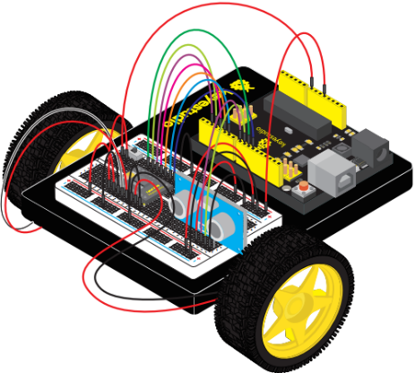
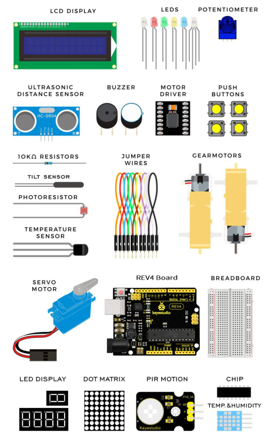
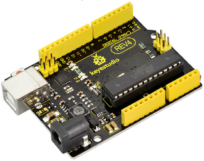
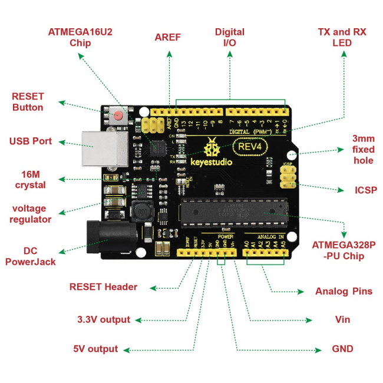
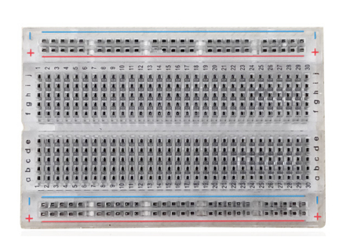
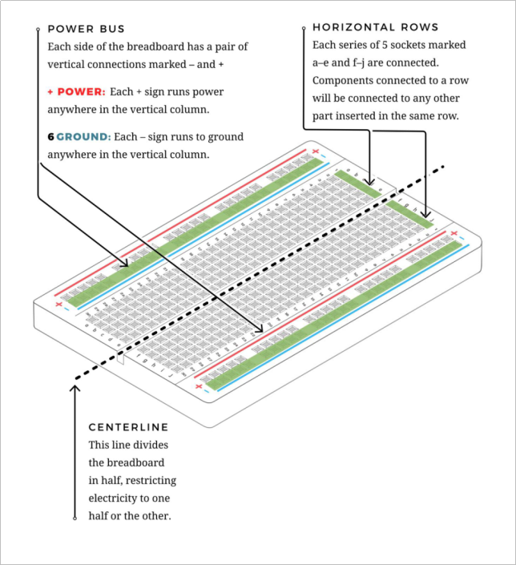

# 1. Product introduction

**KS0436 keyestudio Ultimate Starter Kit For Little Inventor (Zero-based Arduino Learning Robot)**

## 1.1 The Parts List

The Kit contains extensive electronic components. Below shows you a part of kit components:

## 1.2 The REV4 Board Platform

The keyestudio REV4 Board is your development platform.

The REV4 Board is essentially a small, portable computer, also known as a microcontroller. It is capable of taking inputs (such as the push of a button or a reading from a light sensor) and interpreting that information to control various outputs (like blinking an LED light or spinning an electric motor).

This board is capable of taking the world of electronics and relating it to the physical world in a real and tangible way.

**The keyestudio REV4 Board** is a microcontroller board based on the ATmega328P microprocessor. It has 14 digital input/output pins (of which 6 can be used as PWM outputs), 6 analog inputs, a 16 MHz quartz crystal, a USB connection, a power jack, 2 ICSP headers and a reset button.

It contains everything needed to support the microcontroller; simply connect it to a computer with a USB cable or power it via an external DC power jack (DC 7-12V) or via female headers Vin/GND(DC 7-12V) to get started.

**Hardware Overview**

## 1.3 The Breadboard Platformv

A breadboard is a circuit-building platform that allows you toconnect multiple components without using a soldering iron.

This is a half-size transparent breadboard, good for small projects.

It has 2 power rails on both sides, a standard double-strip in the middle with 30 columns and 10 rows - a total of 400 tie in points.

This tiny breadboard also has a self-adhesive on the back, so you can stick it onto an Arduino protoshield or keyestudio chassis.

**Breadboard Use:**

