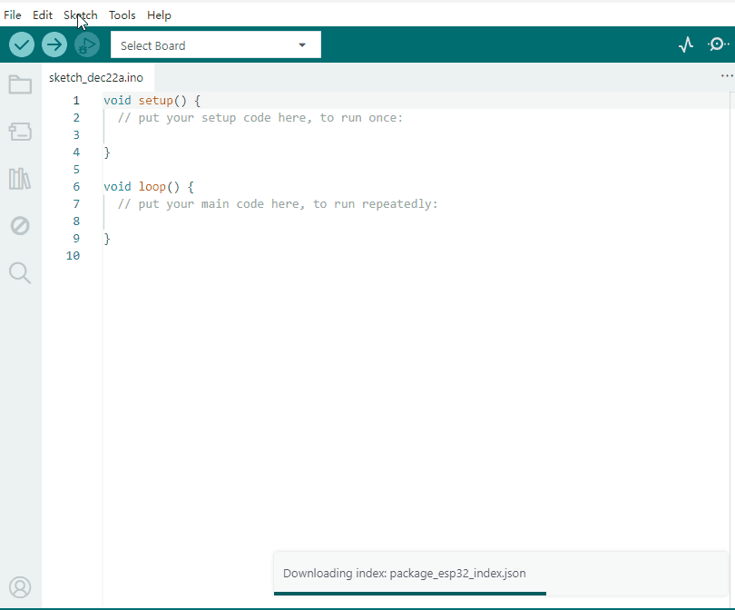
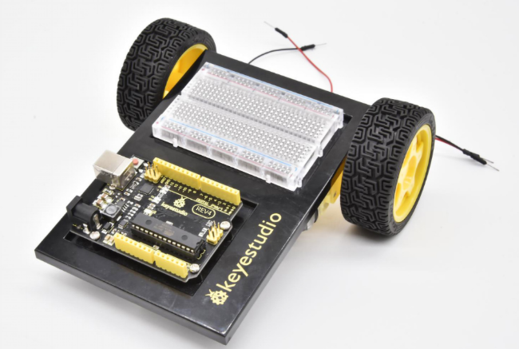

3. Arduino Tutorial
===================

3.1 Data download
-----------------

Arduino information contains library files and project code ,please
click to download for follow-up study.

Data download: :download:`Arduino <./Arduino.7z>`

3.2 Software Download
---------------------

Open the browser and search: https://www.arduino.cc/en/software, we will
take WINDOWS system as an example to show you how to download and
install.

|image1|

You just need to click JUSTDOWNLOAD,then click the downloaded file to
install it.And when the ZIP file is downloaded,you can directly unzip
and start it.

|image2|

3.3 Set Arduino IDE
-------------------

Connecting the board to the computer，and select the development board
and port.

|image3|

3.4 Add Library
---------------

Open the Arduino IDE, follow [Sketch] → [Include Library] → [Add .zip
Library]. This method can only import one library file at a time. If the
product has multiple libraries, please import them one by one following
this process!

|image4|

3.5 Project
-----------

.. toctree::
    :maxdepth: 1

    Project/Project1
    Project/Project2
    Project/Project3
    Project/Project4
    Project/Project5
    Project/Project6
    Project/Project7
    Project/Project8
    Project/Project9
    Project/Project10
    Project/Project11
    Project/Project12
    Project/Project13
    Project/Project14
    Project/Project15
    Project/Project16
    Project/Project17
    Project/Project18
    Project/Project19
    Project/Project20
    Project/Project21

**GET STARTED WITH CIRCUIT PROJECTS!**

There are 21 circuit projects total. Each project will introduce new
concepts and components, which will be described in more detail as you
progress through the circuits.

As you work your way through each circuit, you will learn to use new and
more complicated parts to accomplish increasingly complex tasks.

The project will set the foundation for the rest and will aid in helping
you understand the fundamentals of circuit building and electricity!

**GET STARTED WITH ROBOT PROJECTS!**

|image5|

In this project, you will learn all about DC motors and motor drivers by
building your own robot!You’ll first learn motor control basics. By
adding an IR receiver, remote control the robot to move freely. By
adding an IR receiver or distance sensor, the robot can learn how to
avoid obstacles.

**Please follow the installation guide for the car as shown in the
picture below. After completing the installation, continue studying from
Project 22 to Project 26.**

.. toctree::
    :maxdepth: 1

    Project/Project22
    Project/Project23
    Project/Project24
    Project/Project25
    Project/Project26

|image6|

.. |image1| image:: media/1.gif
.. |image2| image:: media/2.gif
.. |image3| image:: media/Anima.gif

.. |image6| image:: media/image-20251222163054095.png
