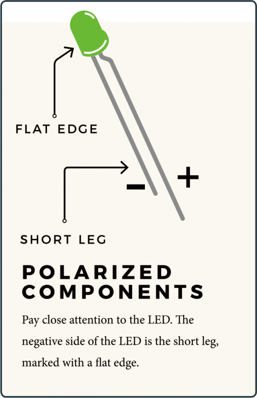
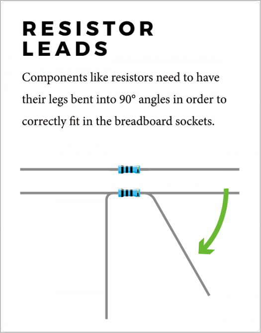
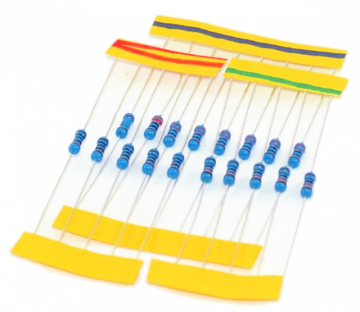
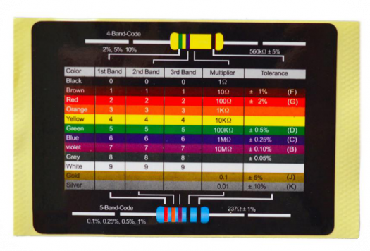
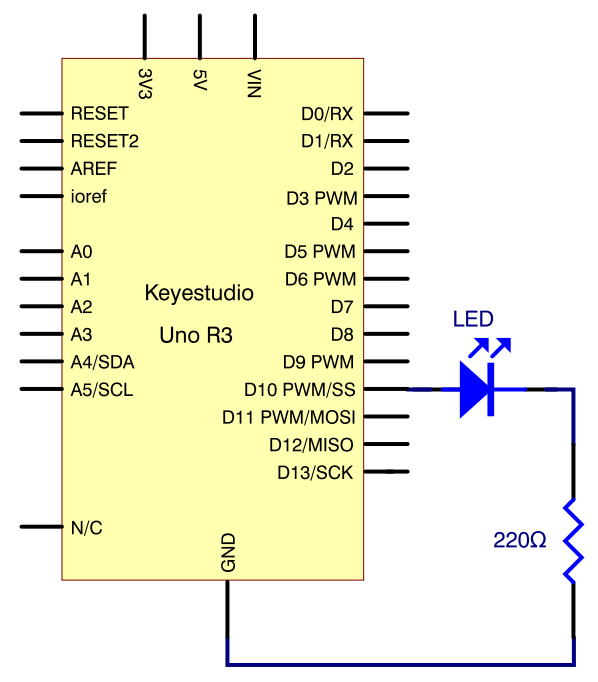
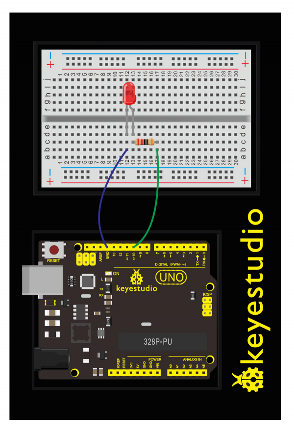
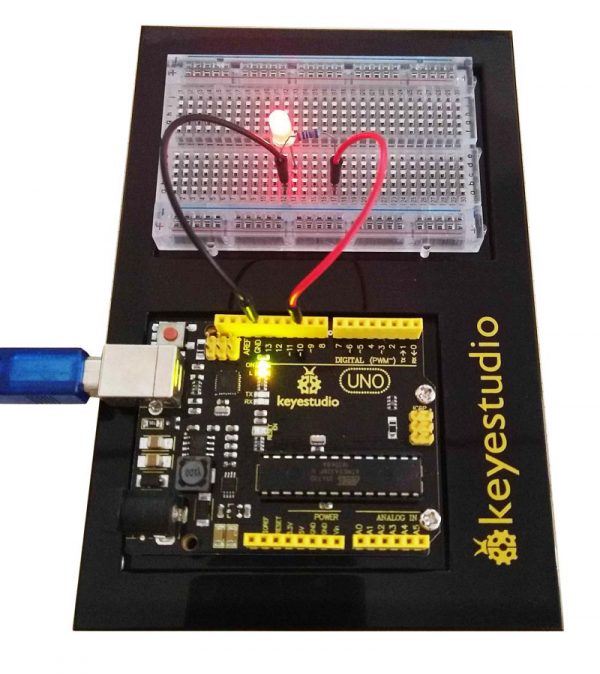

### Project 1 Blinking an LED

**1.About this circuit**

Blinking an LED is the classic starting point for learning how to program embeddedelectronic components. In this circuit, you’ll write code that makes an LED blink on and off.

**2.What You Need**

| REV4 Baseplate                         | Red LED x 1      | 220Ω Resistor x 1 | Jumper wires x 2 | USB cable x 1    |
| -------------------------------------- | ---------------- | ----------------- | ---------------- | ---------------- |
|  |  |   |  |  |

**3.Component Introduction**

- LIGHT-EMITTING DIODES (LEDS)



They come in different colors, brightness and sizes. LEDs have a positive (+) leg and a negative (-) leg, and they will only let electricity flow through them in one direction.

LEDs can also burn out if too much electricity flows through them, so you should always use a resistor to limit the current when you wire an LED into a circuit.

- RESISTORS

Resist the flow of electricity.



You can use them to protect sensitive components like LEDs. The strength of a resistor (measured in ohms) is marked on the body of the resistor using small colored bands.

Each color stands for a number, which you can look up using a resistor chart.





**4.Wiring Diagram**

Check out the schematics and wiring diagram below to see how everything is connected.





With the 220Ω resistor in place, the LED should be quite bright.If you swap out the 220Ω resistor for the 1kΩ resistor, then the LED will appear a little dimmer.

At the moment, you have Digital pin 10 going to one leg of the resistor, the other leg of the resistor going to the positive side of the LED and the other side of the LED going to GND.

**5.Upload Code**

```c
int ledPin = 10; // define digital pin 10.

void setup()
{
	pinMode(ledPin, OUTPUT);// define pin with LED connected as output.
}

void loop()
{
    digitalWrite(ledPin, HIGH); // set the LED on.
    delay(1000); // wait for a second.
    digitalWrite(ledPin, LOW); // set the LED off.
    delay(1000); // wait for a second
}
```

**6.Code Explanation**

- The first line of code is:

```
int ledPin = 10; // define digital pin 10
```

As the comment above it explains, this is giving a name to the pin that the LED is connected to. You can change the connection pin here.

- Next, we have the “setup” and “loop” function

```
void setup()
```

Every Arduino sketch must have a 'setup' function, and the place where you might want to add instructions of your own is between the { and the }. In this case, there is just one command there, which, as the comment states tells the Arduino board that we are going to use the LED pin as an output.

```
void loop()
```

It is also mandatory for a sketch to have a “loop” function. Unlike the 'setup' function that only runs once, after a reset, the 'loop' function will, after it has finished running its commands, immediately start again.

- Input Or Output 

```
pinMode(ledPin, OUTPUT)
```

Before you can use one of the digital pins, you need to tell the REV4 Board whether it is an INPUT or OUTPUT.

We use a built-in “function” called pinMode() to make pin 10 a digital output.

- Digital Output

```
digitalWrite(ledPin, HIGH);
digitalWrite(ledPin, LOW);
```

When you’re using a pin as an OUTPUT, you can command it to be HIGH (output 5 volts) or LOW (output 0 volts).

**7.Result**

After downloading this program, in the experiment, you will see the LED flashing on for one second, then off for one second.

The blinking LED experiment is now completed. Thank you!

