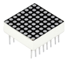
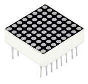
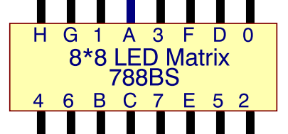
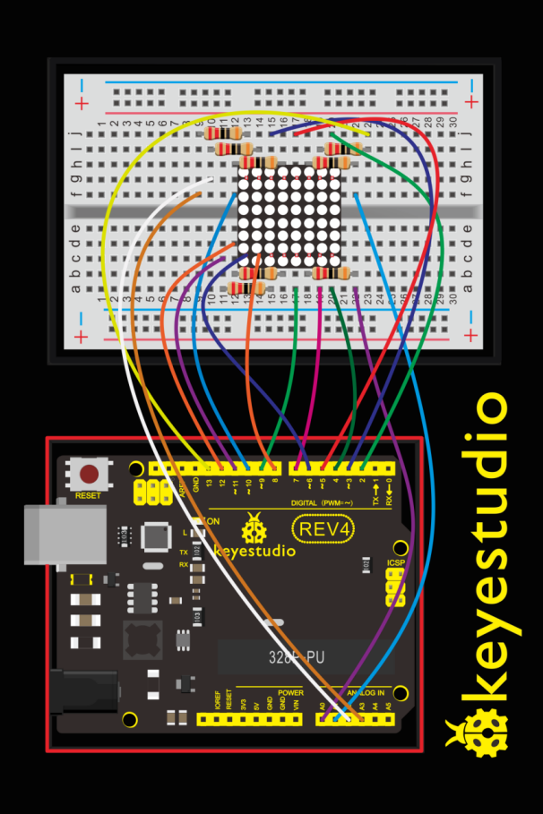
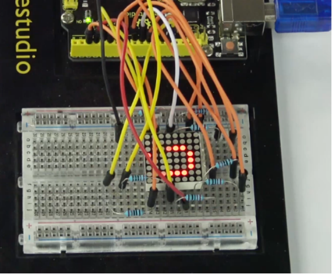

### Project 10 LED Matrix Display

**1.About this circuit**

In this circuit, you will learn how to control the LED matrix showing the number.

**2.What You Need**

| REV4 Baseplate                         | LED matrix display x 1                 | 220Ω Resistor x 8 | Jumper wires x 16 | USB cable x 1    |
| -------------------------------------- | -------------------------------------- | ----------------- | ----------------- | ---------------- |
|  |  |   |   |  |

**3.Component Introduction**

LED Matrix display:

Now, we are going to learn 8*8 dot matrix. It consists of 64 LEDs, located in every crossing of each row and column.



Welding pins on the 8\*8 dot matrix:



When a row is at level 1, and a column at level 0 simultaneously, LED lights up that is between high and low level. For instance, if you want to light up the first LED, connect pin 7 to high level, and pin A to low level; if you want to light up LEDs in first row, connect pin 7 to high level, and pin A, B, C, D, E, F, G, H to low level; if you want to light up LEDs in first column, connect pin A to high level, and pin 0, 1, 2, 3, 4, 5, 6, 7 to low level shown as below figure.


**4.Hookup Guide**

Check out the circuit diagram and hookup table below to see how everything is connected.




**5.Upload Code**

```c
//define an array to store “0”
unsigned char Text[]={0x00,0x1c,0x22,0x22,0x22,0x22,0x22,0x1c};
void Draw_point(unsigned char x,unsigned char y)//draw-point function
{
   clear_();
   digitalWrite(x+2, HIGH);
   digitalWrite(y+10, LOW);
   delay(1);
}

void show_num(void)//show function and invoke draw-point function
{
  unsigned char i,j,data;
  for(i=0;i<8;i++)
  {
    data=Text[i];
    for(j=0;j<8;j++)
    {
      if(data & 0x01)Draw_point(j,i);
      data>>=1;
    }  
  }
}

void setup()
{ 
    int i = 0 ; 
    for(i=2;i<18;i++) 
     { 
       pinMode(i, OUTPUT); 
      }  
      clear_(); 
}

void loop()
{ 
    show_num();    
} 

void clear_(void)//clear screen
{
    for(int i=2;i<10;i++)
    digitalWrite(i, LOW);
    for(int i=0;i<8;i++)
    digitalWrite(i+10, HIGH);
}
```

**6.Result**

Hookup well and upload the code to board, the LED matrix is displaying the “0”.

