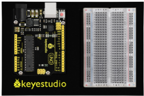
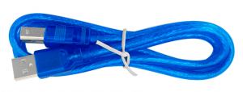
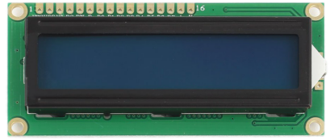
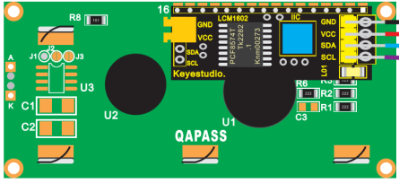
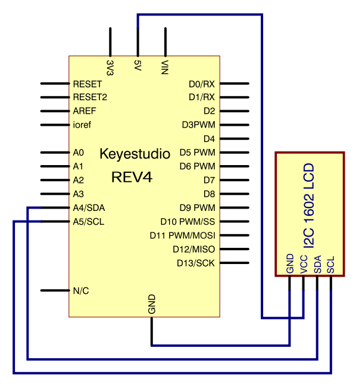
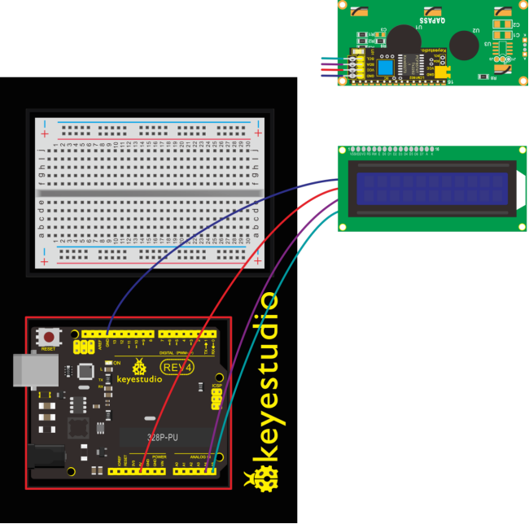
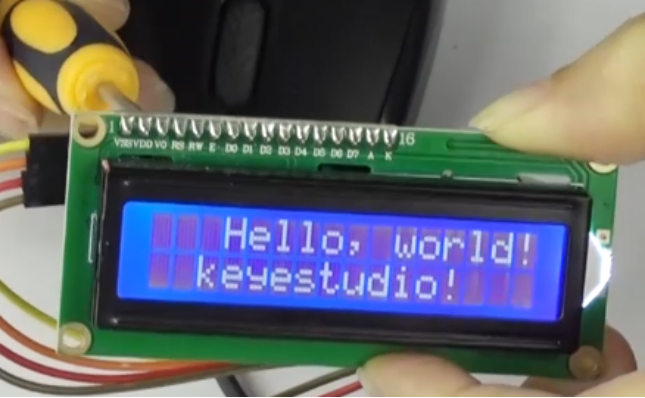

### Project 11 LCD “Hello, World!”

**1.About this circuit**

Printing “Hello, world!” is usually the first thing that programming tutorials will have you do in a new language. Now we’re going to print out real text using a Liquid Crystal Display (LCD).

**2.What You Need**

| REV4 Baseplate                         | 1602 LCD display x 1 | Jumper wires x 4 | USB cable x 1    |
| -------------------------------------- | -------------------- | ---------------- | ---------------- |
|  |   |  |  |

**3.Component Introduction**



Designed to show a grid of letters, numbers and other special characters, LCDs are great for printing data and showing values.

Adding an LCD to your project will make it super portable and allow you to integrate up to 32 characters (16x2) of information.

On the back of LCD display there is a blue potentiometer. You can turn the potentiometer to adjust the contrast. Notice that the screen will get brighter or darker and that the characters become more visible or less visible.



**4.Introduction to the pins of LCD1602**

- **GND:** A pin that connects to ground
- **VCC:** A pin that connects to a +5V power supply
- **SDA:** A pin that connects to analog port A4 for IIC communication
- **SCL:** A pin that connects to analog port A5 for IIC communication

**5.Hookup Guide**

Check out the circuit diagram and hookup table below to see how everything is connected.





**6.Upload Code**

```c
#include <Wire.h>
#include <LiquidCrystal_I2C.h>
LiquidCrystal_I2C lcd(0x27,16,2); // set the LCD address to 0x27 for a 16 chars and 2 line display

void setup()
{
    lcd.init(); // initialize the lcd
    lcd.init();
    // Print a message to the LCD.
    lcd.backlight();
    lcd.setCursor(3,0);
    lcd.print("Hello, world!");
    lcd.setCursor(2,1);
    lcd.print("keyestudio!");
}
void loop()
{
}
```

**7.Result**

Hookup well and upload the code to board, you should see the words “ Hello, World!” and “keyestudio” pop up on your LCD.

Remember you can adjust the contrast using the potentiometer if you can’t make out the words clearly.

