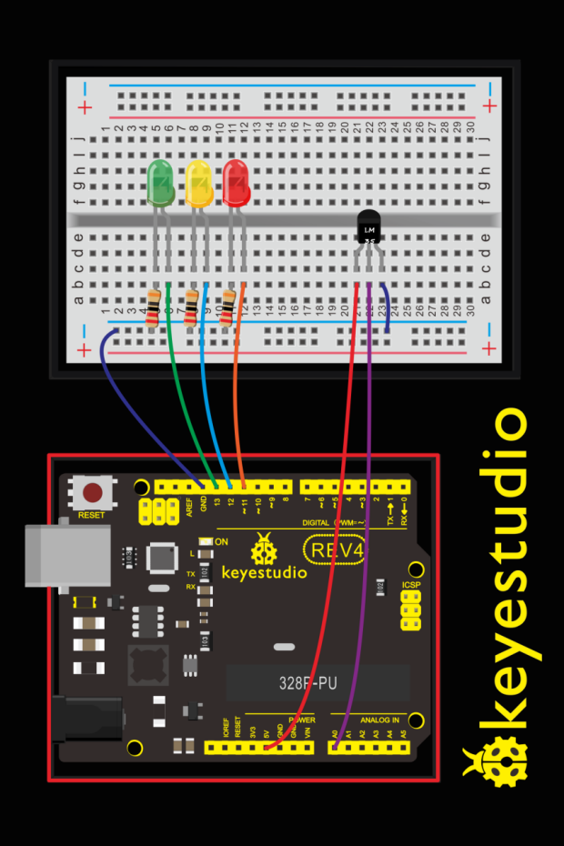
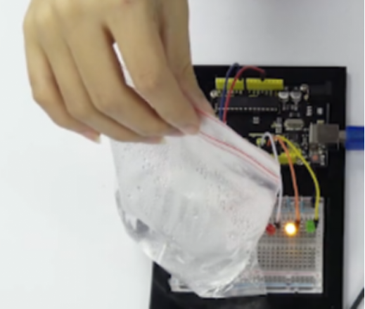
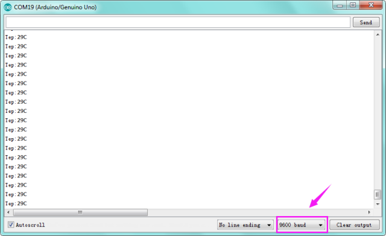

### Project 12 Temperature Sensor

**1.About this circuit**

In this circuit you can use a small, low-cost sensor like the LM35 to make devices that track and respond to temperature.

**2.What You Need**

| REV4 Baseplate                         | Red LED x 1      | Yellow LED x 1                         | Green LED x 1                          |
| -------------------------------------- | ---------------- | -------------------------------------- | -------------------------------------- |
|  |  |  |  |
| 220Ω Resistor x 3                      | Jumper wires x 7 | USB cable x 1                          | LM35 temperature sensor x 1            |
|                        |  |                        |  |

**3.Component Introduction**


This temperature sensor has three legs. One connects to 5V, one to ground, and the voltage output from the second leg varies proportionally to changes in temperature.




**4.Upload Code**

```c
void setup() 
{
	Serial.begin(9600);
  pinMode(13, OUTPUT);
  pinMode(12, OUTPUT);
  pinMode(11, OUTPUT);
}

void loop() 
{
  int vol = analogRead(A0) * (5.0 / 1023.0*100);   // read temperature value of LM35
  Serial.print("Tep:");
  Serial.print(vol);
  Serial.println("C");
  if (vol<28)                     // low temperature area and LED setup
  {
      digitalWrite(13, HIGH);
      digitalWrite(12, LOW);
      digitalWrite(11, LOW);
  }
  else if (vol>=28 && vol<=30)                            
  {
      digitalWrite(13, LOW);
      digitalWrite(12, HIGH);
      digitalWrite(11, LOW);
  }
  else if (vol>30)                       //  low temperature area and LED setup
  {
      digitalWrite(13, LOW);
      digitalWrite(12, LOW);
      digitalWrite(11, HIGH);
  }
}
```

**5.Result**

After uploading the code, open the serial monitor, it will show the temperature value.

Corresponding LED will be turned on in accordance with corresponding temperature range. Put a bag filled with hot water close to the sensor.

When the temperature is lower than 28℃, green LED turns on; When it is greater than or equal to 28℃ but less than 30℃, yellow LED turns on; if greater than 30℃, red LED turns on.



