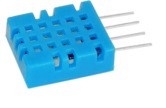
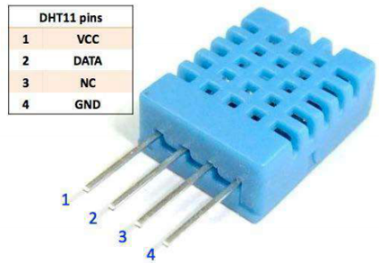
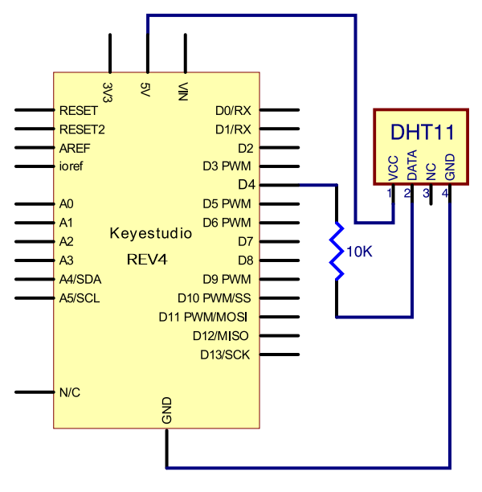
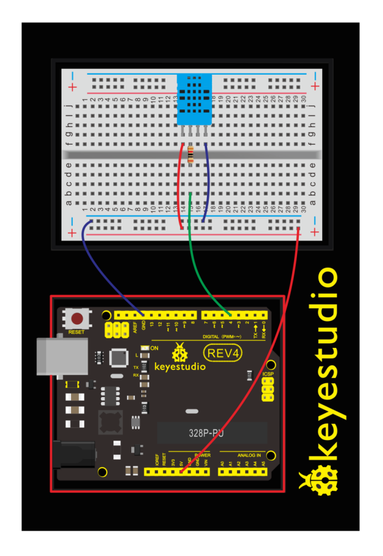
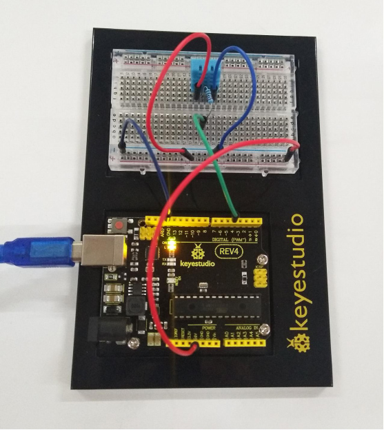
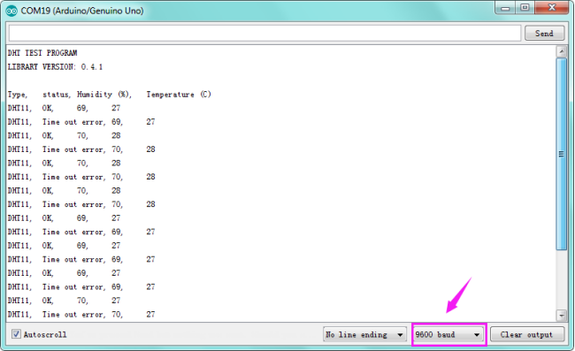

### Project 13 Temperature and Humidity

**1.About this circuit**

In this circuit you will learn how to use a DHT11 Temperature and Humidity Sensor.It’s accurate enough for most projects that need to keep track of humidity and temperature reading.

**2.What You Need**

| REV4 Baseplate                         | DHT11 sensor x 1                       | 10KΩ Resistor x 1                      | Jumper wires x 5                | USB cable x 1                 |
| -------------------------------------- | -------------------------------------- | -------------------------------------- | ------------------------------- | ----------------------------- |
|  |  |  | Jumper wires：  | USB cable ：  |

**3.Component Introduction**



This DHT11 Temperature and Humidity Sensor features calibrated digital signal output with the temperature and humidity sensor complex. Its technology ensures high reliability and excellent long-term stability. A high-performance 8-bit microcontroller is connected. 

This sensor includes a resistive element and a sense of wet NTC temperature measuring devices. It has excellent quality, fast response, anti-interference ability and high cost performance advantages.

Each DHT11 sensor features extremely accurate calibration data of humidity calibration chamber. The calibration coefficients stored in the OTP program memory, internal sensors detect signals in the process, and we should call these calibration coefficients. 

Qualities of small size, low power, and 20-meter signal transmission distance make it a wide applied application and even the most demanding one. Convenient connection, special packages can be provided according to users need.

**4.Hookup Guide**

Check out the circuit diagram and hookup table below to see how everything is connected.





**5.Upload Code**

```c
#include <dht11.h>
dht11 DHT;
#define DHT11_PIN 4

void setup()
{
    Serial.begin(9600);
    Serial.println("DHT TEST PROGRAM ");
    Serial.print("LIBRARY VERSION: ");
    Serial.println(DHT11LIB_VERSION);
    Serial.println();
    Serial.println("Type,\tstatus,\tHumidity (%),\tTemperature (C)");
}

void loop()
{
    int chk;
    Serial.print("DHT11, \t");
    chk = DHT.read(DHT11_PIN);// READ DATA
    switch (chk)
    {
        case DHTLIB_OK:
            Serial.print("OK,\t"); 
            break;
        case DHTLIB_ERROR_CHECKSUM: 
            Serial.print("Checksum error,\t"); 
            break;
        case DHTLIB_ERROR_TIMEOUT: 
            Serial.print("Time out error,\t"); 
            break;
        default: 
            Serial.print("Unknown error,\t"); 
            break;
	}
    // DISPLAT DATA
    Serial.print(DHT.humidity,1);
    Serial.print(",\t");
    Serial.println(DHT.temperature,1);
    delay(1000);
}
```

**6.Result**



After uploading the code, open the serial monitor, it will show the temperature and humidity value of current environment.


