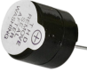
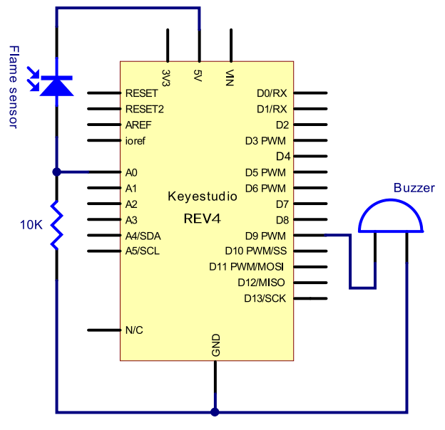
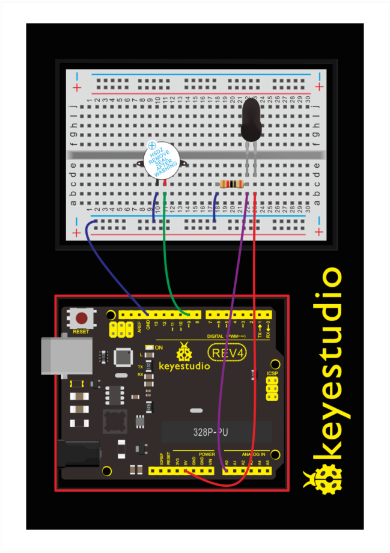
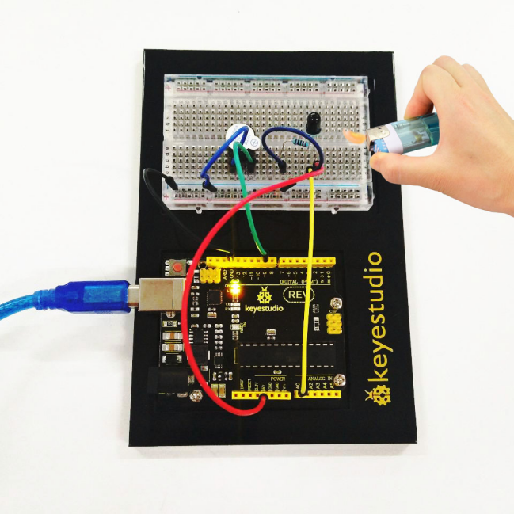

### Project 14 Flame Sensor

**1.About this circuit**

In this circuit you will learn how to use a flame sensor to trigger a buzzer making an alarm when detecting the fire.

**2.What You Need**

| REV4 Baseplate                         | Flame sensor x 1                       | Active buzzer x 1                      | 10KΩ Resistor x 1                      | Jumper wires x 6 | USB cable x 1    |
| -------------------------------------- | -------------------------------------- | -------------------------------------- | -------------------------------------- | ---------------- | ---------------- |
|  |  |  |  |  |  |

**3.Component Introduction**

**Flame Sensor:** Flame sensor (Infrared receiving triode) is specially used on robots to find the fire source. This sensor is of high sensitivity to flame. Below is a photo of it.


**Working Principle:** Flame sensor is made based on the principle that infrared ray is highly sensitive to flame. It has an infrared receiving tube specially designed to detect fire, and then convert the flame brightness to fluctuating level signal. The signals are then input into the central processor and be dealt with accordingly.

**Sensor Connection:**  The shorter lead of the receiving triode is for negative, the other one for positive. Connect negative to 5V pin, positive to resistor; connect the other end of the resistor to GND, connect one end of a jumper wire to a clip which is electrically connected to sensor positive, the other end to analog pin. 

As shown below:


**4.Hookup Guide**

Check out the circuit diagram and hookup table below to see how everything is connected.





**5.Upload Code**

When it's approaching a fire, the voltage value read from the analog port differs. If you use a multimeter, you can know when there is no fire approaching, the voltage it reads is around 0.3V; when there is fire approaching, the voltage it reads is around 1.0V.

The nearer the fire, the higher the voltage. So in the beginning of the program, you can initialize voltage value i (no fire value); Then, continuously read the analog voltage value j and obtain difference value k=j-i; compare k with 0.6V (123 in binary) to determine whether or not there is a fire approaching; if yes, the buzzer will buzz.

```c
int flame=0;// select analog pin 0 for the sensor
int Beep=9;// select digital pin 9 for the buzzer
int val=0;// initialize variable

void setup() 
{
   pinMode(Beep,OUTPUT);// set LED pin as “output”
   pinMode(flame,INPUT);// set buzzer pin as “input”
   Serial.begin(9600);// set baud rate at “9600”
} 

void loop() 
{ 
  val=analogRead(flame);// read the analog value of the sensor 
  Serial.println(val);// output and display the analog value
  if(val>=600)// when the analog value is larger than 600, the buzzer will buzz
  {  
     digitalWrite(Beep,HIGH); 
  }
  else 
  {  
     digitalWrite(Beep,LOW); 
  }
  delay(500); 
}
```

**6.Result**

After uploading the code, once the sensor detects the flame, the buzzer will immediately make a sound. If no fire, everything is normal.


