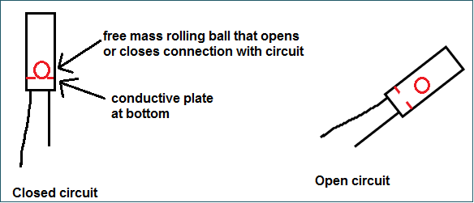
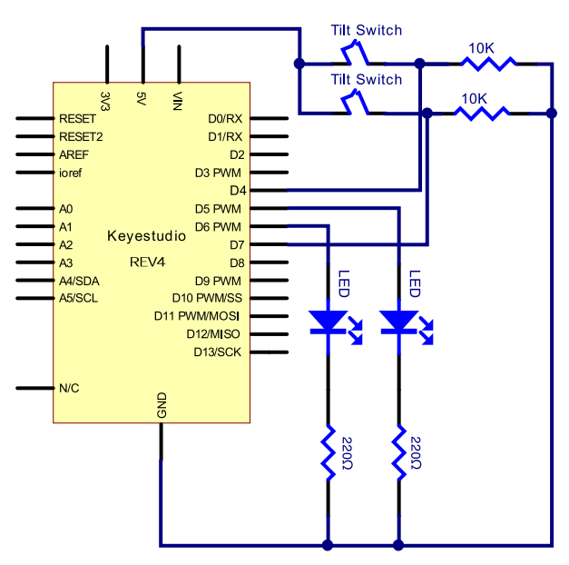
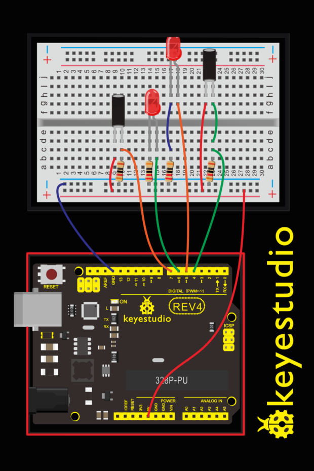
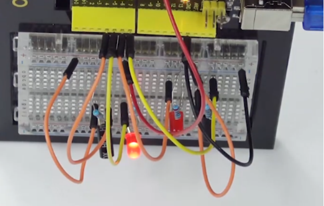

### Project 15 Tilt Ball Switch

**1.About this circuit**

In this circuit you will learn how to use two tilt ball switches to control two LED lights on and off.

**2.What You Need**

| REV4 Baseplate                         | Tilt ball switch x 2                   | Red LED x 1      | 220Ω Resistor x 2 |
| -------------------------------------- | -------------------------------------- | ---------------- | ----------------- |
|  |  |  |   |
| 10KΩ Resistor x 2                      | Jumper wires x 10                      | USB cable x 1    |                   |
|                        |                        |  |                   |

**3.Component Introduction**


Tilt sensors (tilt ball switch) allow you to detect orientation or inclination. They are small,inexpensive, low-power and easy-to-use. If used properly, they will not wear out.

The tilt-switch twig is the equivalent of a button, and is used as a digital input. Inside the tilt switch is a ball that make contact with the pins when the case is upright. Tilt the case over and the balls don't touch, thus not making a connection. When the switch is level it is open, and when tilted, the switch closes.
It can be used for orientation detection, alarm device or others.

Here is the principle of tilt sensor to illustrate how it works:



**4.Hookup Guide**

Check out the circuit diagram and hookup table below to see how everything is connected.





**5.Upload Code**

```c
int LedPinA = 5;
int LedPinB = 6;
int ButtonPinA = 7;
int ButtonPinB = 4;
int buttonStateA = 0;
int buttonStateB = 0;
int brightnessA = 0;
int brightnessB= 255;
void setup()
{
    Serial.begin(9600);
    pinMode(LedPinA, OUTPUT);
    pinMode(LedPinB, OUTPUT);
    pinMode(ButtonPinA, INPUT);
    pinMode(ButtonPinB, INPUT);
}

void loop()
{
    buttonStateA = digitalRead(ButtonPinA);
    if (buttonStateA == HIGH && brightnessA != 255)
    {
    	brightnessA ++;
    }
    if (buttonStateA == LOW && brightnessA != 0)
    {
    	brightnessA --;
    }
    analogWrite(LedPinB, brightnessA);
    Serial.print(brightnessA);
    Serial.print("   ");
    buttonStateB = digitalRead(ButtonPinB);
    if (buttonStateB == HIGH && brightnessB != 0)
    {
    	brightnessB --;
    }
    if (buttonStateB == LOW && brightnessB != 255)
    {
    	brightnessB++;
    }
    analogWrite(LedPinA, brightnessB); 
    Serial.println(brightnessB);
    delay(5);
}
```

**6.Result**

Tilt the circuit to one side, one LED gradually turns on and another LED turns off.

