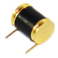
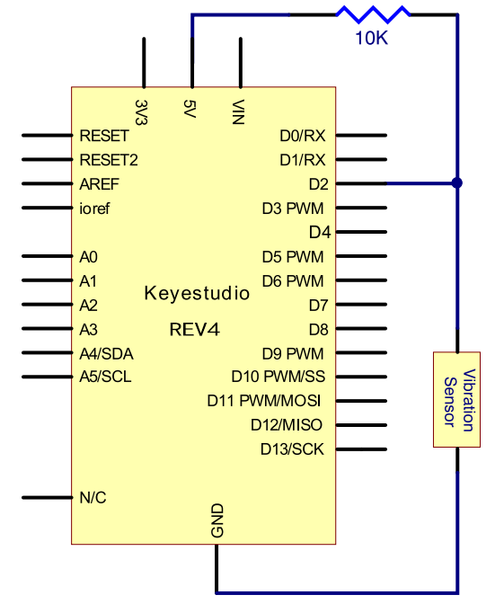
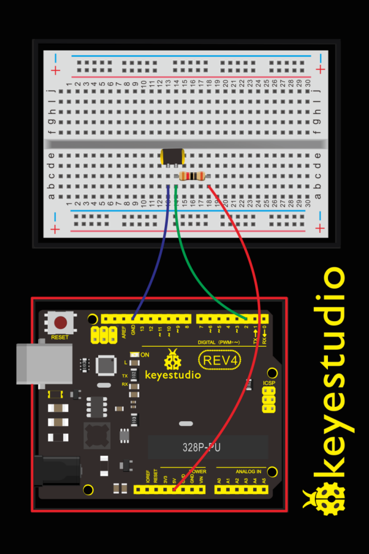

### Project 16 Vibration Switch

**1.About this circuit** 

In this circuit you will learn how to test the vibration switch.

**2.What You Need**

| REV4 Baseplate                         | Vibration switch x 1                   | 10KΩ Resistor x 1                      | Jumper wires x 3 | USB cable x 1    |
| -------------------------------------- | -------------------------------------- | -------------------------------------- | ---------------- | ---------------- |
|  |  |  |  |  |

**3.Component Introduction**



It is a electronic switch that can sense the intensity of vibration and transfer the result to the circuit device, and activate the circuit to start working.

**4.Hookup Guide**

Check out the circuit diagram and hookup table below to see how everything is connected.





**5.Upload Code**

```c
#define SensorLED     13
#define SensorINPUT   2  
unsigned char state = 0; 

void setup() 
{ 
  pinMode(SensorLED, OUTPUT); 
  pinMode(SensorINPUT, INPUT);
  attachInterrupt(0, blink, FALLING);//D2 as external interruption 0, when there is falling trigger and call blink function
}

void loop()
{
      if(state!=0)
      {
        digitalWrite(SensorLED,HIGH);
        delay(3000);
        state = 0;
      }   
      else 
        digitalWrite(SensorLED,LOW);
}  
 
void blink()// digital input of the sensor falling, triggering interruption function
{
  state++;
}
```

**6.What You Will See**

Done uploading the code, vibrate the desk where the sensor placed; once the sensor detects vibration, the D13 led on the REV4 board turns on for 3 seconds then off.
