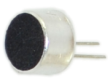
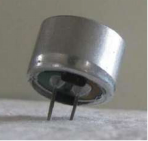
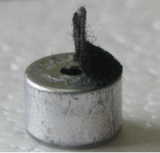
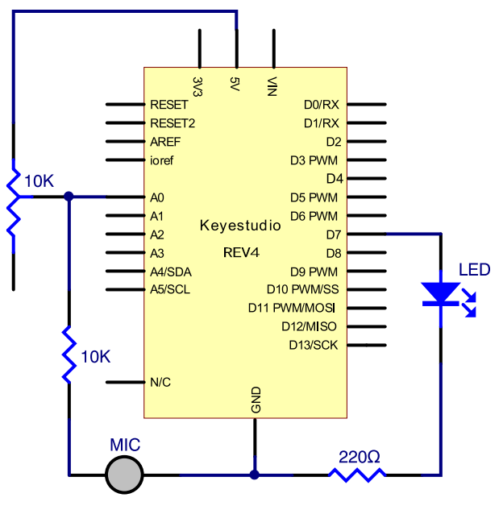
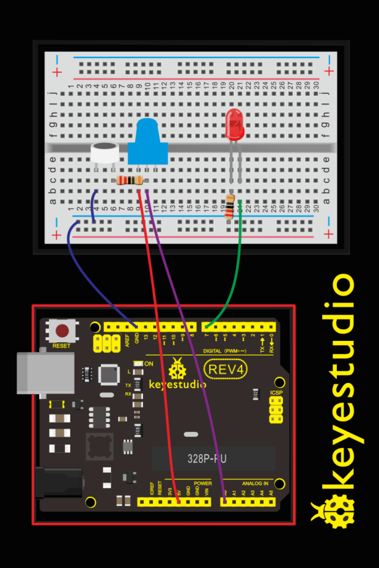
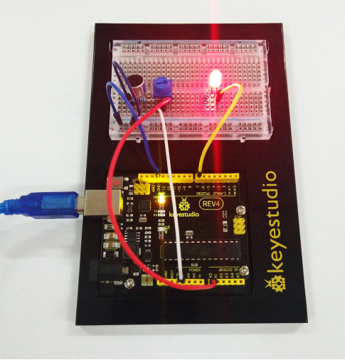

### Project 17 Sound Sensor

**1. About this circuit**

In this circuit you will learn how to use a microphone sound sensor to turn an LED on and off.

**2.What You Need:**

| REV4 Baseplate                         | Sound sensor x 1                       | Red LED x 1      | 220Ω Resistor x 2 | Jumper wires x 10 | USB cable x 1    |
| -------------------------------------- | -------------------------------------- | ---------------- | ----------------- | ----------------- | ---------------- |
|  |  |  |   |   |  |

**3.Component Introduction**



Transducers are devices which convert energy from one form to other. A microphone is a transducer which converts sound energy to electrical signals. It works opposite to a speaker.

These microphones are widely used in electronic circuits to detect minor sounds or air vibrations which in turn are converted to electrical signals for further use. The two legs as shown in the image above are used to make electrical connection with the circuit.

The top face is covered with a porous material with the help of glue. It acts as a filter for the dust particles.

The sound signals/air vibrations passes through the porous material and falls on the diaphragm through the hole shown in the image above.



**4.Hookup Guide**

Check out the circuit diagram and hookup table below to see how everything is connected.





**5.Upload Code**

```c
int LEDpin = 7;                 // set pin for LED 

void setup() 
{
  Serial.begin(9600);
  pinMode(LEDpin,OUTPUT);
}

void loop() 
{
  int Soundvalue = analogRead(A0);  // read the input analog value
  Serial.println(Soundvalue);
  if(Soundvalue>700)
  {
     digitalWrite(LEDpin,HIGH);      // when the analog value is bigger than the set value, turn on the LED
     for(int i=0;i<5;i++) 
     {
       delay(1000);                    // wait for 5s
     }
  }
  else
  {
     digitalWrite(LEDpin,LOW);      // turn off the LED 
  }
}
```

**Note:** It has no processing of the signal from the MIC, so signal is weak and insensitive. Instead of sound signal, we blow air to the MIC.

By rotating the potentiometer, the analog value of A0 changes; After adjusting the potentiometer, blow air into the MIC, and observe the data in the serial monitor.

For example, the displayed data is less than 300 before blowing; after blowing, data is more than 700.

Setup code if (Soundvalue >700), control the LED on and off; the on time of the LED is controlled by the code for**(int i=0;i<5;i++) { delay(1000); }**, so the light is on for 5*1s.

**6.Result**

Turn the potentiometer to adjust the sensitivity of led light.Done uploading the code, open the serial monitor and set the baud rate to 9600.

Clapping your hands, you should see the LED turn on for 5 seconds then off. The data is showed on the monitor.



