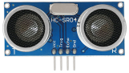
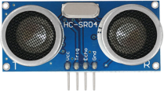
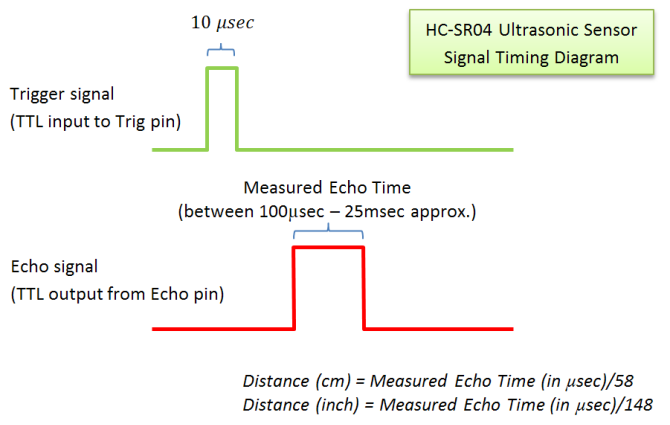
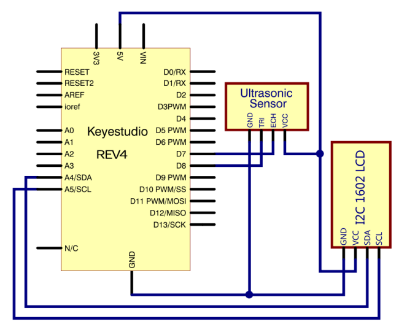
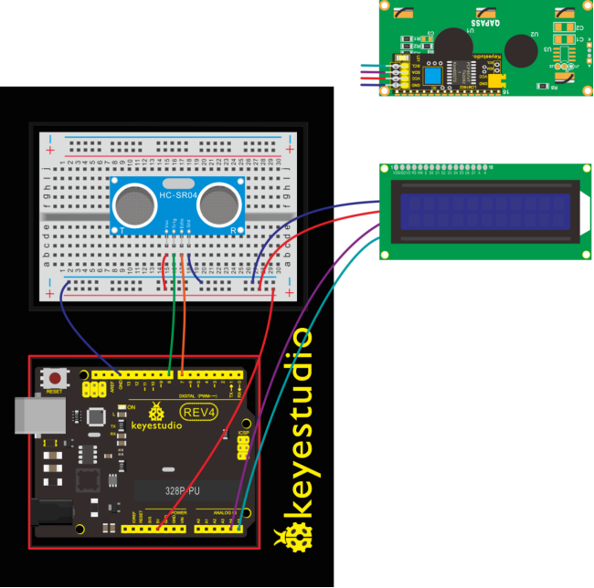
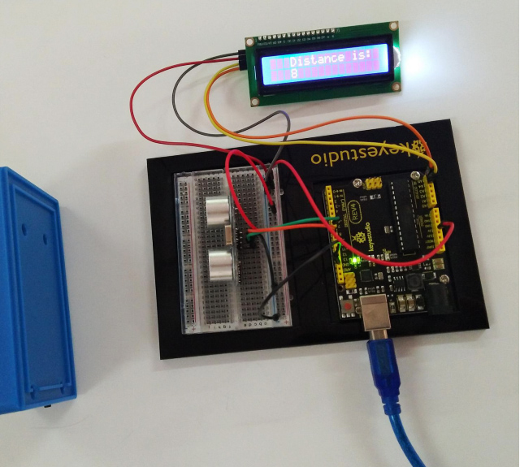
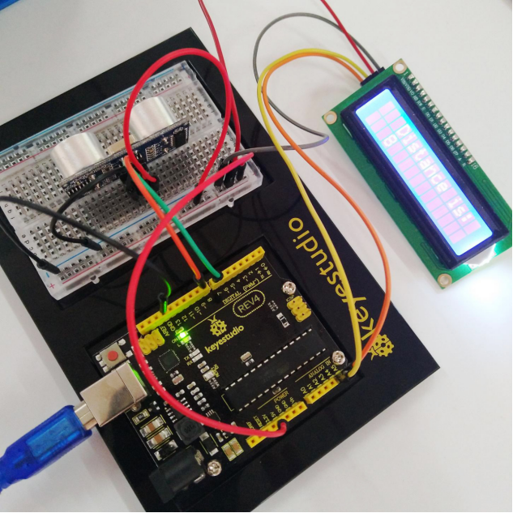

###  Project 18 Distance Sensor

**1.About this circuit**

Distance sensors are amazing tools with all kinds of uses. They can sense the presence of an object, they can be used in experiments to calculate speed and acceleration, and they can be used in robotics to avoid obstacles.

This circuit will walk you through the basics of using an ultrasonic distance sensor, which measures distance using sound waves!

**2.What You Need**

| REV4 Baseplate                         | ultrasonic sensor x 1                  | 1602 LCD display x 1 | Jumper wires x 10 | USB cable x 1    |
| -------------------------------------- | -------------------------------------- | -------------------- | ----------------- | ---------------- |
|  |  |   |   |  |

**3.Component Introduction**



Ultrasonic sensor module HC-SR04 provides 2cm-400cm non-contact measurement function, the ranging accuracy can reach to 3mm. The modules includes ultrasonic transmitters, receiver and control circuit. 

Distance sensors work by sending pulses of light or sound out from a transmitter, then timing how long it takes for the signals to bounce off an object and return to a receiver (just like sonar).



**4.TECH SPECS**

- Operating Voltage: 5V（DC）
- Operating Current: 15mA
- Operating Frequency: 40khz
- Maximum Detection Distance: 3-5m
- Minimum Detection Distance: 3-4cm
- Sensing Angle: less than 15 degrees

**5.PINS**


**6.Hookup Guide**

Check out the circuit diagram and hookup table below to see how everything is connected.





**7.Upload Code**

```c
#include <Wire.h> 
#include <LiquidCrystal_I2C.h>
LiquidCrystal_I2C lcd(0x27,16,2);
#define echoPin 7 // Echo Pin
#define trigPin 8 // Trigger Pin
#define LEDPin 13 // Onboard LED

int maximumRange = 200; // Maximum range needed
int minimumRange = 0; // Minimum range needed
long duration, distance; // Duration used to calculate distance

void setup() 
{
  lcd.init();                      // initialize the lcd 
  lcd.init();
  // Print a message to the LCD.
  lcd.backlight();
  lcd.setCursor(3,0);
  lcd.print("Distance is:  ");
  pinMode(trigPin, OUTPUT);
  pinMode(echoPin, INPUT);
  pinMode(LEDPin, OUTPUT); // Use LED indicator (if required)
}

void loop() 
{
   /* The following trigPin/echoPin cycle is used to determine the
   distance of the nearest object by bouncing soundwaves off of it. */ 
   digitalWrite(trigPin, LOW); 
   delayMicroseconds(2); 

   digitalWrite(trigPin, HIGH);
   delayMicroseconds(10); 
   digitalWrite(trigPin, LOW);

   duration = pulseIn(echoPin, HIGH);
   //Calculate the distance (in cm) based on the speed of sound.
   distance = duration/58.2;
 
   if (distance >= maximumRange || distance <= minimumRange)
   {
       /* Send a negative number to computer and Turn LED ON 
       to indicate "out of range" */
       lcd.setCursor(3,1);
       lcd.print("-1   ");
       digitalWrite(LEDPin, HIGH); 
   }
   else 
   {
     /* turn LED OFF to indicate successful reading. */
      lcd.setCursor(3,1);
      lcd.print(distance);
     digitalWrite(LEDPin, LOW); 
   }
   if(distance<10)
   {
      lcd.setCursor(4,1);
      lcd.print("    ");
   }
   if(distance<100)
   {
      lcd.setCursor(5,1);
      lcd.print("    ");
   }
   //Delay 50ms before next reading.
   delay(50);
} 
```

**8.What You Will See**

Move your hand or a large, flat object closer and farther away from the distance sensor. As the object approaches, the LCD display screen will show the distance being read from the sensor.



