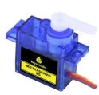
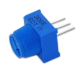
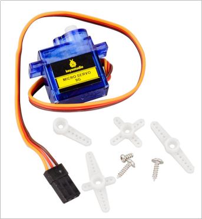
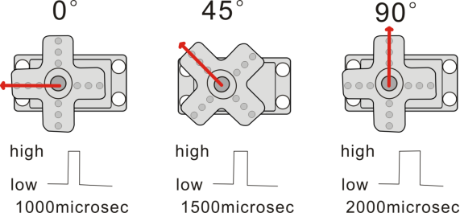
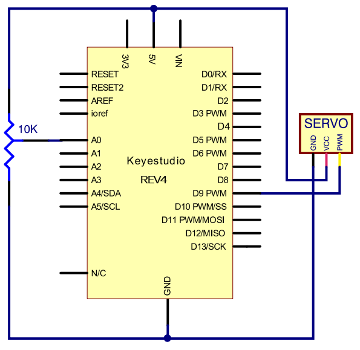
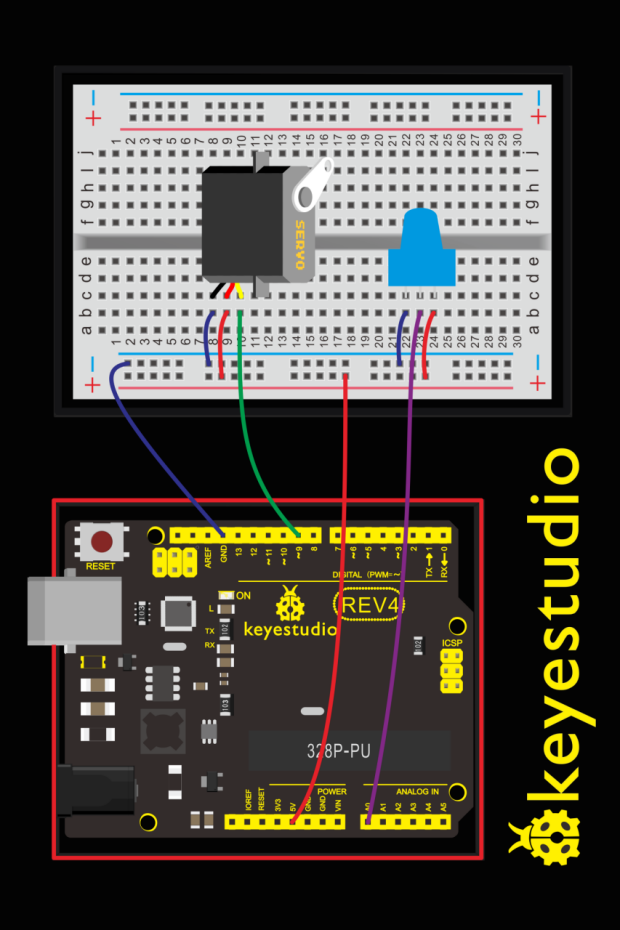
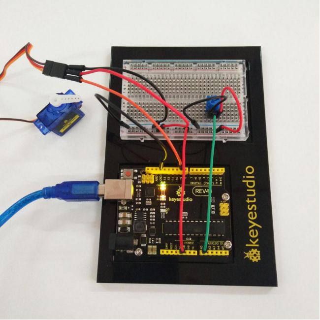
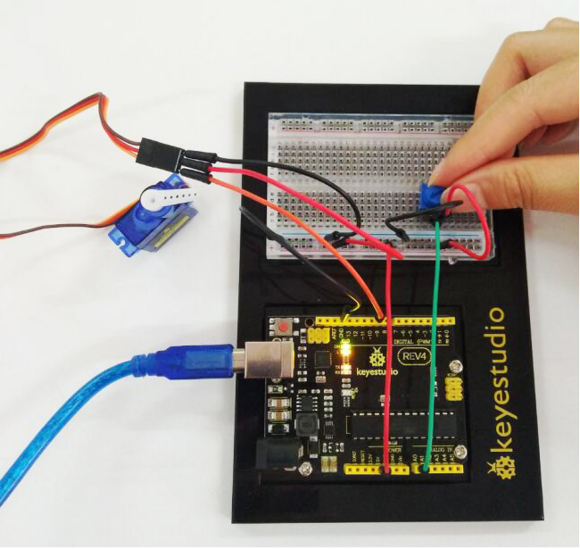
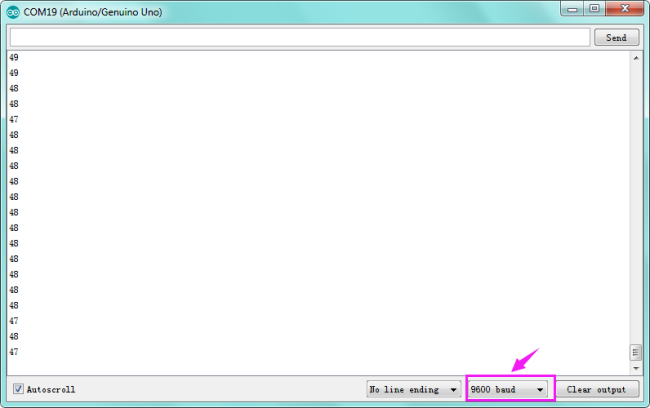

### Project 19 Driving Servo Motor

**1.About this circuit**

In this circuit, you will learn how to wire a servo and control it with code. Servo motors can be told to move to a specific position and stay there. Here we will turn a potentiometer to make the servo rotate in a certain angle.

**2.What You Need**

| REV4 Baseplate                         | Servo motor x 1                        | Potentiometer x 1                      | Jumper wires x 8 | USB cable x 1    |
| -------------------------------------- | -------------------------------------- | -------------------------------------- | ---------------- | ---------------- |
|  |  |  |  |  |

**3.Component Introduction**

The servo has three interfaces,distinguished by brown, red and orange line (different brand may have different color). Brown line is for GND, red one for power 5V, orange one for signal terminal (PWM signal).



Included with your servo motor you will find a variety of white motor mounts that connect to the shaft of your servo.

You may choose to attach any mount you wish for the circuit. It will serve as a visual aid, making it easier to see the servo spin.

The rotation angle of servo is controlled by regulating the duty cycle of the PWM(Pulse-Width Modulation) signal. The standard cycle of the PWM signal is fixed at 20ms (50 Hz), and the pulse width is distributed between 1ms-2ms. The pulse width corresponds to the rotation angle ( 0°～90°) of servo.



**4.Hookup Guide**

Check out the circuit diagram and hookup table below to see how everything is connected.





**5.Upload Code**

```c
#include <Servo.h>
Servo myservo;//define steering engine variable
int servo =0;

void setup()
{
    Serial.begin(9600); // 9600 bps
    myservo.attach(9);//define steering engine interface（alternative 9 and 10 but just able to control 2interfaces）
}

void loop()
{
    servo=map ( analogRead(0) , 0 , 1023 , 0 , 180 )  ;
    Serial.println(servo ,DEC);
    myservo.write(servo);//set rotating angle
    delay(50);
}
```

**6.Code Explanation**

```
#include <Servo.h>
```

The #include command adds a library to your Arduino program. After you include a library, you can use the commands in the library in your program.

```
myservo.attach(9)
```

It tells the servo object to which pin the signal wire is attached. It will send position signals to this pin. In this sketch, pin 9 is used.

**7.Result**



Turning the potentiometer will cause the servo arm to turn. The servo will mimic the movement of the potentiometer, twisting in the same clockwise or counter-clockwise direction.

If you’ve attached a white mount to the servo, this movement will be easier to see. Also can check out the angle value on the serial monitor.



