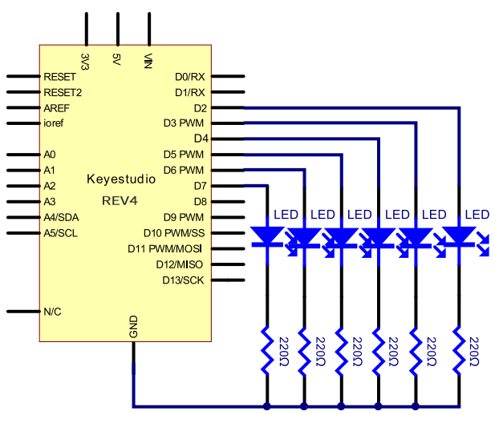
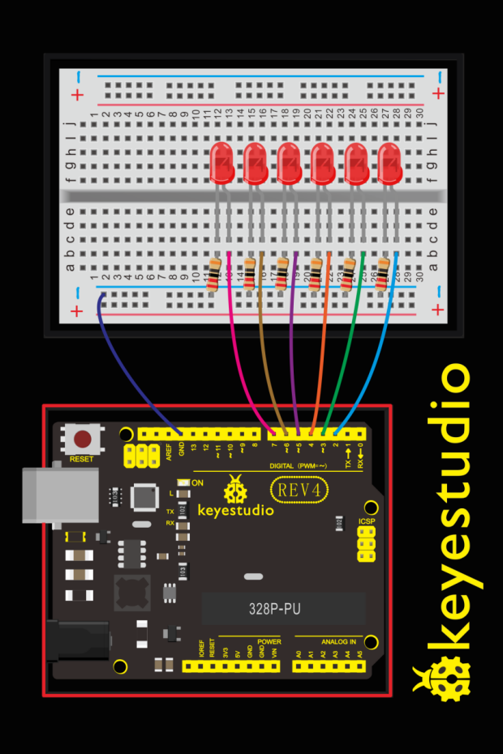
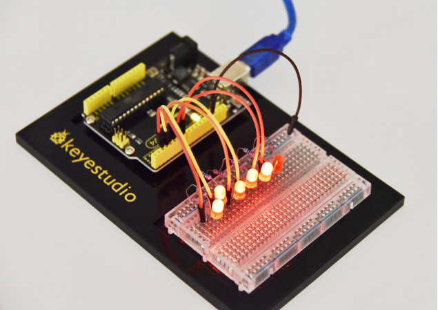

### Project 2 Light Extension

**1.About this circuit**

After mastering LED Blinking, let’s move on to how to control lots of LEDs. The principle is almost the same. In this circuit, you’ll write code that makes six LEDs blink on and off one by one.

Furthermore, you can also use three LEDs to simulate the traffic light. Now let’s start something different!

**2.What You Need**

| REV4 Baseplate                         | Red LED x 6      | 220Ω Resistor x 6 | Jumper wires x 7 | USB cable x 1    |
| -------------------------------------- | ---------------- | ----------------- | ---------------- | ---------------- |
|  |  |   |  |  |

**3.Wiring Diagram**

Check out the wiring below to see how everything is connected.





**4.Upload Code**

```c
int BASE = 2 ;  // the I/O pin for the first LED
int NUM = 6;   // the number of LEDs
void setup()
{
   for (int i = BASE; i < BASE + NUM; i ++) 
   {
     pinMode(i, OUTPUT);   // set I/O pins as output
   }
}

void loop()
{
   for (int i = BASE; i < BASE + NUM; i ++) 
   {
     digitalWrite(i, LOW);    // set I/O pins as “low”, turn off LEDs one by one.
     delay(200);        // delay
   }
   for (int i = BASE; i < BASE + NUM; i ++) 
   {
     digitalWrite(i, HIGH);    // set I/O pins as “high”, turn on LEDs one by one
     delay(200);        // delay
   }  
}
```

**5.Code Explanation**

```
int BASE = 2 ; // set the I/O pin for the first LED
int NUM = 6; // the number of LEDs
```

**6.Result**

You can see the six LEDs blink on and off one by one. It seems like light chasing.If it doesn’t, make sure you have assembled the circuit correctly and verified and uploaded the code to your board. Check out the Board and Serial Port.

