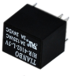
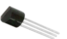
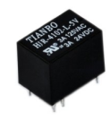
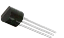
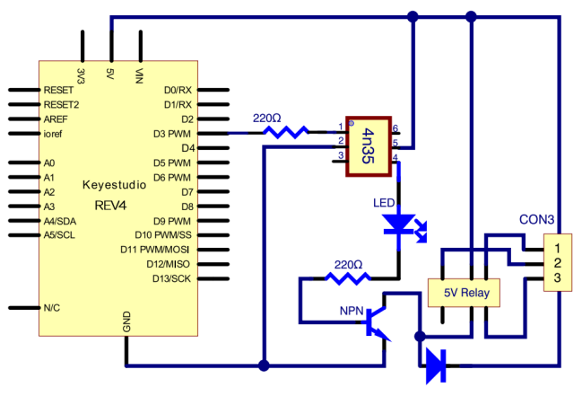
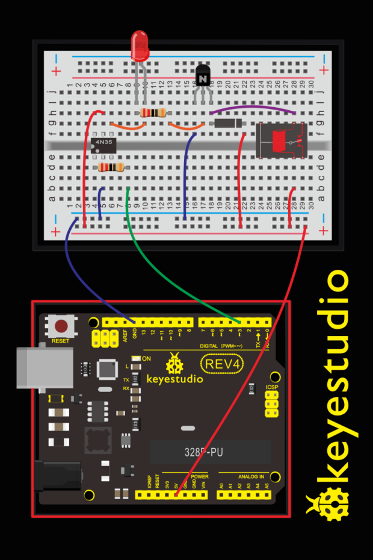
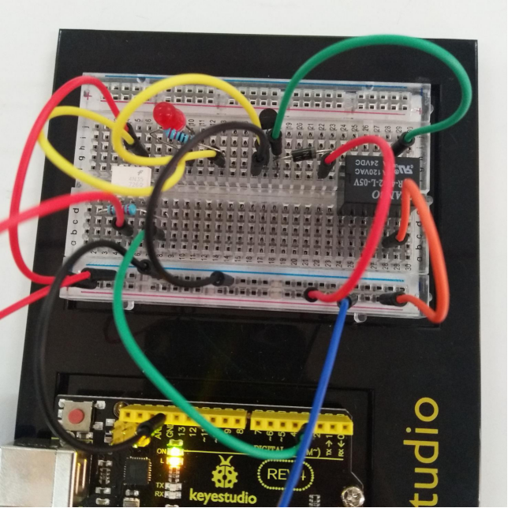
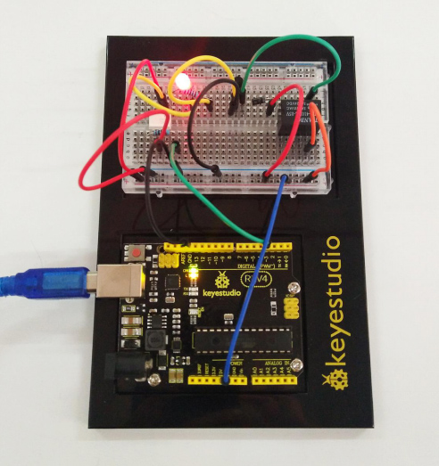

### Project 20 Relay

**1.About this circuit:**

In this circuit, you will learn how to use a relay and other tiny sensors to turn on an LED.

**2.What You Need**

| REV4 Baseplate                         | Relay x 1                              | 4N35  * 1                              | 4007 Diode *1                          | 8050 Transistor *1                     |
| -------------------------------------- | -------------------------------------- | -------------------------------------- | -------------------------------------- | -------------------------------------- |
|  |  |  |  |  |
| Red LED x 1                            | 220Ω Resistor x 2                      | Jumper wires x 11                      | USB cable x 1                          |                                        |
|                        |                        |                        |                        |                                        |

**3.Component Introduction**

- **Relay:** A relay is basically an electrically controlled mechanical switch with isolation function.
  Relays are used where it is necessary to control a circuit by a low power signal (with complete electrical isolation between control and controlled circuits), or where several circuits must be controlled by one signal. It's widely used in remote control, remote sensing, communication, automatic control, and electronic devices. It is one of the most important control elements.



- **4N35 IC:** The 4N35 is a general-purpose optocoupler that contains a gallium arsenide infrared light-emitting diode, which is used to drive silicon phototransistors.


- **4007 Diode:** Used to protect the circuit


- **NPN:**  8050 Transistor



**4.Hookup Guide**

Check out the circuit diagram and hookup table below to see how everything is connected.





(pay attention to using the NPN 8050 transistor; the plug direction of 4N35, relay and diode )



**5.Upload Code**

```c
int relay = 3; // relay turn-on trigger signal - active high;

void setup ()
{
	pinMode (relay, OUTPUT); //define port attribute for the output;
}

void loop ()
{
    digitalWrite (relay, HIGH); // relay conducted;
    delay (1000);
    digitalWrite (relay, LOW); // relay switch;
    delay (1000);
}
```

**6.What You Will See**

Here, when S is in high level, relay switches to the ON end. LED will be turned on. In the test result, you should be able to hear the relay contacts click, and see the LED turning on and off at 1-second intervals.

