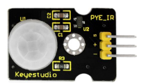
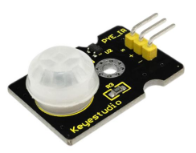
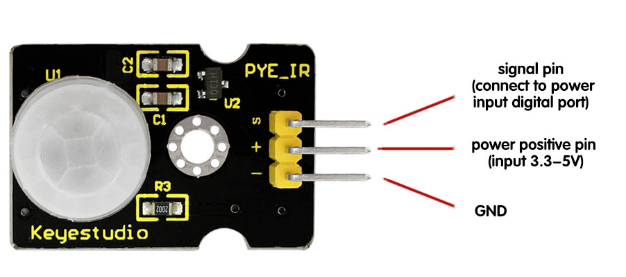
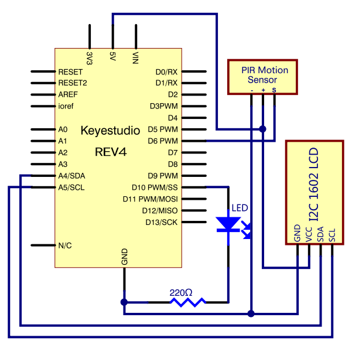
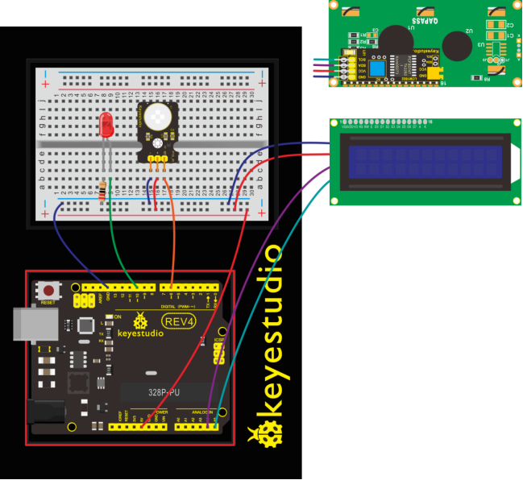
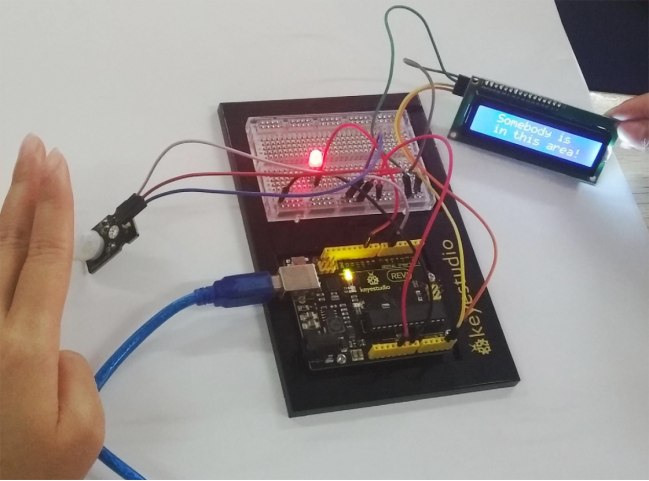

### Project 21 PIR Motion Sensor

**1.About this circuit** 

In this lesson we will create an alarm system to detect motion, combining usage of PIR sensor, 1602 LCD and LED.

**2.What You Need**

| REV4 Baseplate                         | PIR motion sensor x 1                  | 1602 LCD display x 1                   | Red LED x 1      |
| -------------------------------------- | -------------------------------------- | -------------------------------------- | ---------------- |
|  |  |     |  |
| 220Ω Resistor x 1                      | M-M Jumper wires x 7                   | M-F Jumper wires x 3                   | USB cable x 1    |
|                        |  |  |  |

**3.Component Introduction**



The Pyroelectric infrared motion sensor can detect infrared signals from a moving person or moving animal, and output switching signals. It can be applied to a variety of occasions to detect the movement of human body.

**4.Parameters**

- Input Voltage: DC 3.3V ~ 18V
- Working Current: 15uA
- Working Temperature: -20 ~ 85 ℃
- Output Voltage: High 3V, Low 0V
- Output Delay Time (High Level): About 2.3 to 3 Seconds
- Detection Angle: 100°
- Detection Distance: 7 meters
- Output Indicator LED (If it is HIGH level, it will be ON)
- Pin Limit Current: 100mA



**5.Hookup Guide**

Check out the circuit diagram and hookup table below to see how everything is connected.





**6.Upload Code**

```c
#include <Wire.h> 
#include <LiquidCrystal_I2C.h>
LiquidCrystal_I2C lcd(0x27,16,2);
byte sensorPin = 6;
byte indicator = 10;

void setup()
{
  lcd.init();                      // initialize the lcd 
  lcd.init();
  // Print a message to the LCD.
  lcd.backlight();
  pinMode(sensorPin,INPUT);
  pinMode(indicator,OUTPUT);
  Serial.begin(9600);
}

void loop()
{
  byte state = digitalRead(sensorPin);
  digitalWrite(indicator,state);
  if(state == 1)
  {
      lcd.setCursor(2,0);
      lcd.print("Somebody is");
      lcd.setCursor(2,1);
      lcd.print("in this area!");
  }
  else if(state == 0)
  {
      lcd.setCursor(2,0);
      lcd.print("No one!      ");
      lcd.setCursor(2,1);
      lcd.print("No one!      ");
      delay(500);
  }
}
```

**7.Result**

Move your hand or a large, flat object closer and farther away from the PIR sensor.If the LCD shows ”Somebody is in this area!” and LED lights up, it is reminding of you that somebody is here.

Otherwise, it will tell you by displaying “No one!”on LCD and LED off.

