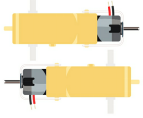
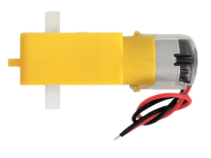
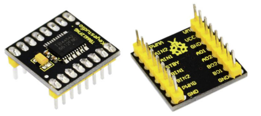
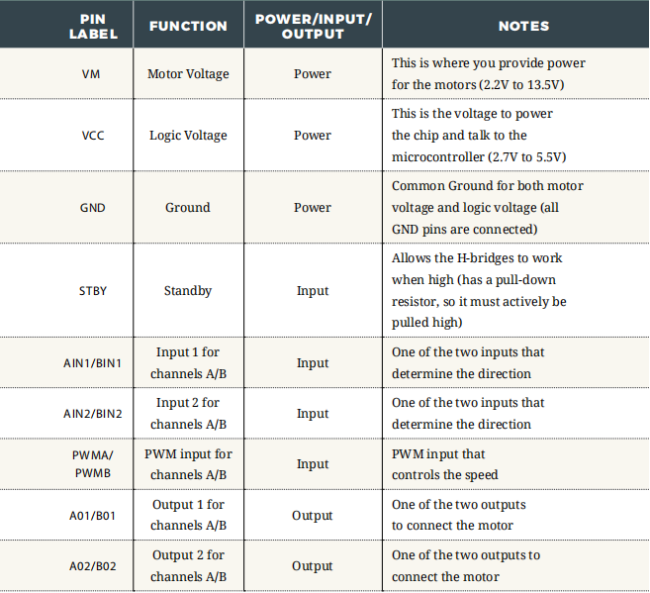
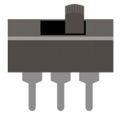
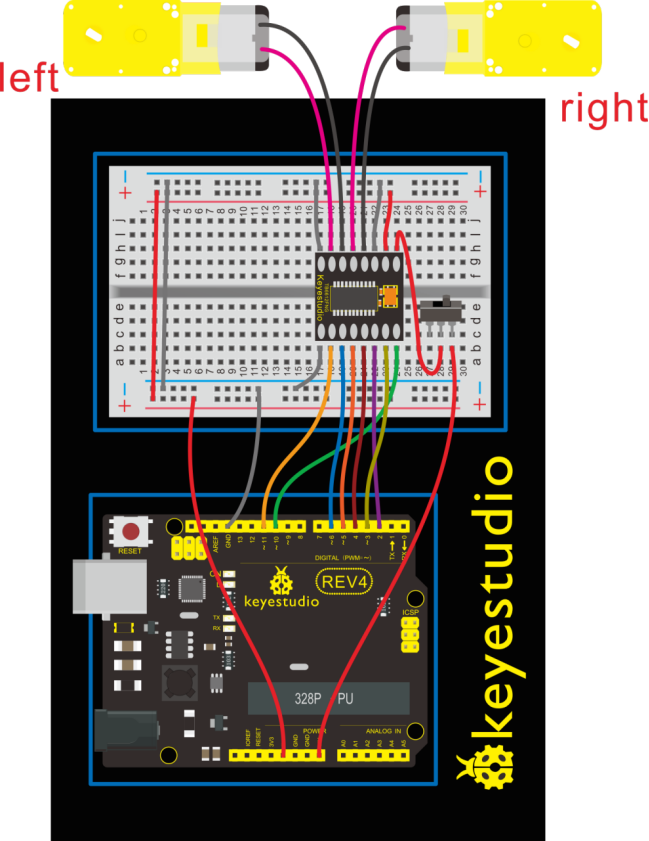
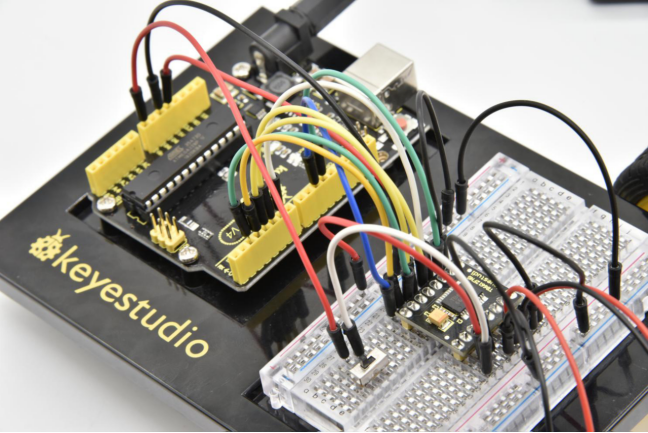
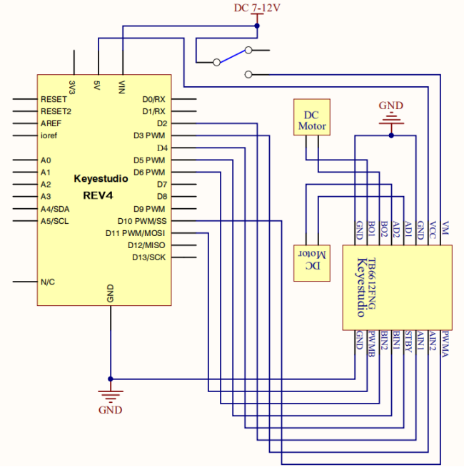
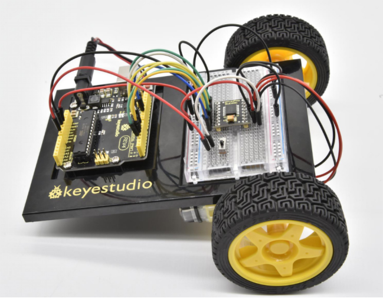

### Project 22 Motor Basics

**<font color ="red">Before studying this course, please follow the images below to find the car installation tutorial and install the car. You can only continue learning after the car is installed.</font>**


**1.About this circuit**

In this circuit, you will learn the basic concepts behind motor control. You’ll use what is known as a motor controller or motor driver board to power and spin the motor accordingly.

**2.What You Need**

| Gear Motor x 2                         | TB6612FNG Motor Driver x 1          | Slide switch x 1                       | Jumper wires x 21 |
| -------------------------------------- | ----------------------------------- | -------------------------------------- | ----------------- |
|  |  |  |   |

**3.Component Introduction**

Gear Motor:



The gear motor has two main parts: a small DC motor that spins quickly and a plastic gearbox that gears down the output from the hobby motor so that it is slower but stronger, allowing it to move your robot.

TB6612FNG Motor Driver:



The TB6612FNG Motor Driver may look complicated, but it’s easy to use. The TB6612FNG motor driver can control up to two DC motors at a constant current of 1.2A (3.2A peak).

Two input signals (IN1 and IN2) can be used to control the motor in one of four function modes - CW, CCW, short-brake, and stop.

The two motor outputs (A and B) can be separately controlled; speed of each motor is controlled via a PWM input signal with a frequency up to 100kHz.

The STBY pin should be pulled high to take the motor out of standby mode. Logic supply voltage (VCC) can be in the range of DC 2.7-5.5V, while the motor supply (VM) is limited to a maximum voltage of 15V DC. The output current is rated up to 1.2A per channel (or up to 3.2A for a short, single pulse).

The motor driver pins are explained in the table below.



Slide switch:



SWITCHES are components that control the open-ness or closed-ness of an electric circuit.

Just like the momentary buttons used in earlier circuits, this type of switch can only exist in one of two states: open or closed.

However, a switch is different in that it will stay in the position it was last in until it is switched again.

**4.Features**

- Power supply voltage: VM=15V max, VCC=2.7-5.5V
- Output current: Iout=1.2A(average) / 3.2A (peak)
- Standby control to save power
- CW/CCW/short brake/stop motor control modes
- Built-in thermal shutdown circuit and low voltage detecting circuit
- Filtering capacitors on both supply lines

**5.Hookup Guide**

Check out the circuit diagram and hookup table below to see how everything is connected.





**6.Circuit Diagram**



**7.Code 1**

```
int AIN1=2;
int AIN2=3;
int STBY=4;
int BIN1=5;
int BIN2=6;
int PWMA=10;// enable pin 1
int PWMB=11;// enable pin 2
// D2 and D3 as a set, D5 and D6 as a set
// D10 and D11 as enable pins for DC motors

void setup()
{
  int i;
  for (i=2;i<=6;i++) // Ardunio motor driver module
  pinMode(i,OUTPUT); // set digital pins 2,3,4,5,6 as output
  pinMode(10,OUTPUT);// set digital pins 10, 11 as output
  pinMode(11,OUTPUT);
}

void loop()
{
  // 2 DC motor rotate CW for 1S, and rotate CCW for 1S
  // rotate CW
  front();
  delay(1000);
  Stop();
  back(); 
  delay(1000);
  Stop(); 
  delay(1000);
  left(); 
  delay(1000);
  Stop();
  delay(1000);
  right();
  delay(1000);
  Stop();
  delay(1000);
}

void front() 
{
    digitalWrite(STBY,HIGH);
    digitalWrite(AIN1,HIGH);
    digitalWrite(AIN2,LOW);
    analogWrite(PWMA,200);
    digitalWrite(BIN1,HIGH); 
    digitalWrite(BIN2,LOW);
    analogWrite(PWMB,200);
}

void back() 
{
    digitalWrite(STBY,HIGH);
    digitalWrite(AIN1,LOW);
    digitalWrite(AIN2,HIGH);
    analogWrite(PWMA,200); 
    digitalWrite(BIN1,LOW);
    digitalWrite(BIN2,HIGH);
    analogWrite(PWMB,200); 
}

void Stop() 
{
  digitalWrite(STBY,LOW);
}

void left() 
{
    digitalWrite(STBY,HIGH);
    digitalWrite(AIN1,HIGH);
    digitalWrite(AIN2,LOW);
    analogWrite(PWMA,200); 
    digitalWrite(BIN1,LOW);
    digitalWrite(BIN2,HIGH);
    analogWrite(PWMB,200); 
}

void right() 
{
    digitalWrite(STBY,HIGH);
    digitalWrite(AIN1,LOW);
    digitalWrite(AIN2,HIGH);
    analogWrite(PWMA,200); 
    digitalWrite(BIN1,HIGH); 
    digitalWrite(BIN2,LOW);
    analogWrite(PWMB,200); 
}
```

**8.Code 2**

```c
int AIN1=2;
int AIN2=3;
int STBY=4;
int BIN1=5;
int BIN2=6;
int PWMA=10;// enable pin 1
int PWMB=11;// enable pin 2
// D2 and D3 as a set, D5 and D6 as a set
// D10 and D11 as enable pins for DC motors

void setup()
{
  int i;
  for (i=2;i<=6;i++) // Ardunio motor driver module
  pinMode(i,OUTPUT); // set digital pins 2,3,4,5,6 as output
  pinMode(10,OUTPUT);// set digital pins 10, 11 as output
  pinMode(11,OUTPUT);
}

void loop()
{
  // 2 DC motor rotate CW for 1S, and rotate CCW for 1S
  // rotate CW
   digitalWrite(STBY,HIGH);
   digitalWrite(AIN1,HIGH);
   digitalWrite(AIN2,LOW);
   analogWrite(PWMA,200);
   digitalWrite(BIN1,HIGH); 
   digitalWrite(BIN2,LOW);
   analogWrite(PWMB,200);
   delay(1000);
  // pause for 1S
   digitalWrite(STBY,LOW);
   delay(1000);
  	// rotate CCW 
    digitalWrite(STBY,HIGH);
    digitalWrite(AIN1,LOW);
    digitalWrite(AIN2,HIGH);
    analogWrite(PWMA,200); 
    digitalWrite(BIN1,LOW);
    digitalWrite(BIN2,HIGH);
    analogWrite(PWMB,200); 
	delay(1000); 
	// pause for 1S
   digitalWrite(STBY,LOW);
   delay(1000);
}
```

**9.Result**

Uploaded well the code, and flip the switch. The motor will spin at the speed set by the motor speed variable.

Here in the folder we provide two codes for the same wiring method.

If upload the code 1 motor basics, the motor will rotate forward for one second then stop for one second; then go back for one second and stop for one second; followed by turning left for 1S, stop for 1S then turn right for 1S and stop for 1S repeatedly and circularly.

If upload the code 2 motor drive, the motor will rotate forward for one second then stop for one second, followed by turning backward for one second and stop for one second, repeatedly and circularly.

