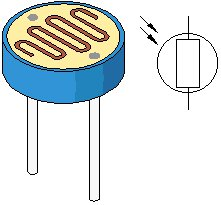
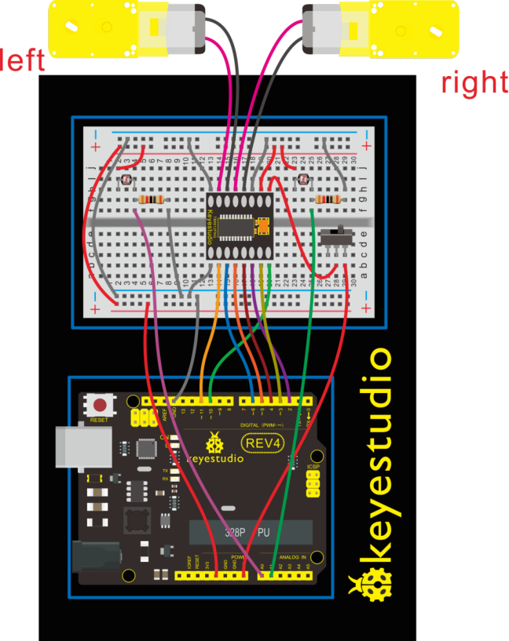
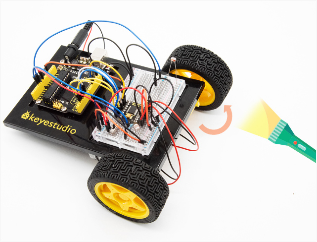
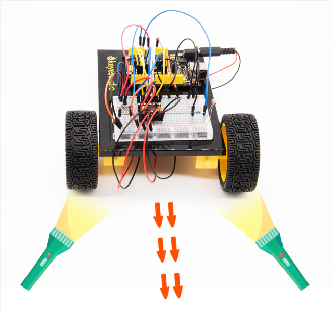

###  Project 23 Light Following Robot

**1.About this circuit**

Using two photo-resistors are a great way to have light control of your project. In this circuit, you’ll control two motors and build your own light following robot! You can use the light source to tell the robot in what direction to move or move straight.

**2.What You Need**

| Gear Motor x 2                         | TB6612FNG Motor Driver x 1          | Slide switch x 1                       | Photo resistor x 2                     | 10KΩ Resistor x 2                      | Jumper wires x 21                      |
| -------------------------------------- | ----------------------------------- | -------------------------------------- | -------------------------------------- | -------------------------------------- | -------------------------------------- |
|  |  |  |  |  |  |

**3.Component Introduction**


Photo resistor (Photovaristor) is a resistor whose resistance varies according to different incident light strength.

It's made based on the photoelectric effect of semiconductor. If the incident light is intense, its resistance reduces; if the incident light is weak, the resistance increases. 

Photo resistor is widely applied to various light control circuit, such as light control and adjustment, optical switches, etc.



**4.Hookup Guide**

Check out the circuit diagram and hookup table below to see how everything is connected.



**5.Circuit Diagram**


**6.Upload Code**

```c
int value1=0;
int value2=0;
int AIN1=2;
int AIN2=3;
int STBY=4;
int BIN1=5;
int BIN2=6;
int PWMA=10;// enable pin 1
int PWMB=11;// enable pin 2
int Fspeed;
int Lspeed;
int Rspeed;

void setup()
{
  Serial.begin(9600);
  int i;
  for (i=2;i<=6;i++) // Ardunio motor driver module
  pinMode(i,OUTPUT); // set digital pins 2,3,4,5,6 as output
  pinMode(10,OUTPUT);// set digital pins 10, 11 as output
  pinMode(11,OUTPUT);
}
 
void loop() 
{      
     value1=analogRead(0);
     value2=analogRead(1);
     Serial.print(value1);
     Serial.print("  ");
     Serial.println(value2);
     if(value1 >900&&value2 >900)         //if front distance is less than 10cm   
     {
     	front(); 
     }
     if(value1 >900&&value2 <=900)         //if front distance is less than 10cm   
     {
     	left();
     }
     if(value1 <=900&&value2 >900)         //if front distance is less than 10cm   
     {
     	right(); 
     }  
     if(value1 <=900&&value2 <=900)         //if front distance is less than 10cm   
     {
     	stop(); 
     }     
}

void front() {
    digitalWrite(STBY,HIGH);
    digitalWrite(AIN1,HIGH);
    digitalWrite(AIN2,LOW);
    analogWrite(PWMA,200);
    digitalWrite(BIN1,HIGH); 
    digitalWrite(BIN2,LOW);
    analogWrite(PWMB,200);
}

void back() 
{
    digitalWrite(STBY,HIGH);
    digitalWrite(AIN1,LOW);
    digitalWrite(AIN2,HIGH);
    analogWrite(PWMA,200); 
    digitalWrite(BIN1,LOW);
    digitalWrite(BIN2,HIGH);
    analogWrite(PWMB,200); 
}

void stop() 
{
  digitalWrite(STBY,LOW);
}

void left() 
{
    digitalWrite(STBY,HIGH);
    digitalWrite(AIN1,HIGH);
    digitalWrite(AIN2,LOW);
    analogWrite(PWMA,200); 
    digitalWrite(BIN1,LOW);
    digitalWrite(BIN2,HIGH);
    analogWrite(PWMB,200); 
}

void right() 
{
    digitalWrite(STBY,HIGH);
    digitalWrite(AIN1,LOW);
    digitalWrite(AIN2,HIGH);
    analogWrite(PWMA,200); 
    digitalWrite(BIN1,HIGH); 
    digitalWrite(BIN2,LOW);
    analogWrite(PWMB,200); 
}
```

**7.Result**

Start by flipping the switch to the ON position. Hook it up and upload the code success, the tank robot is walking with strong light under certain illumination.

When one photoresistor senses the light source, the robot will turn round then follow the light illumination.



Both two photoresistors sense the light source, the robot will go straight to follow the light illumination. Shown below.



