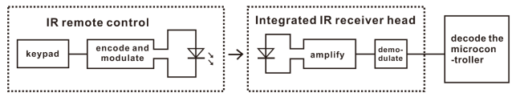
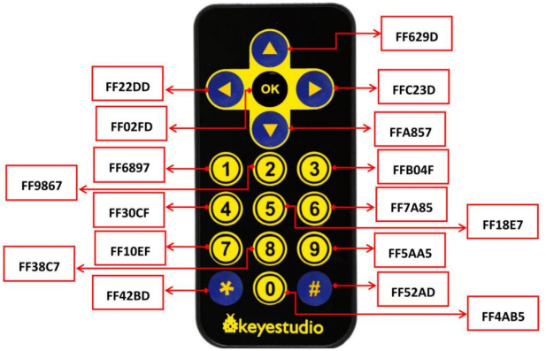
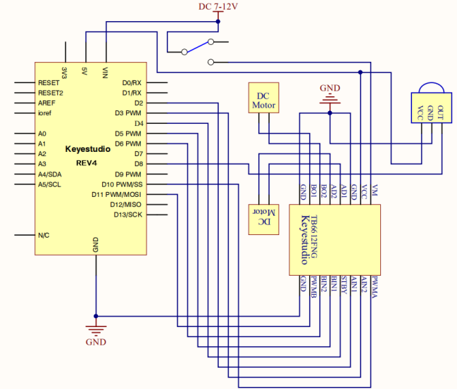
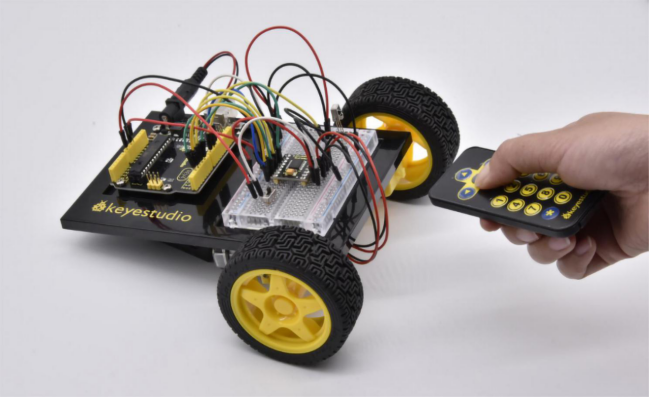

### Project 24 Remote-Controlled Robot

**1.About this circuit**

Using an IR Remote is a great way to have wireless control of your project. In this circuit, you’ll control two motors and build your own remote-controlled roving robot!

You can use the remote controller to tell the robot in what direction to move and how far to move.

**2.What You Need**

| Gear Motor x 2                         | TB6612FNG Motor Driver x 1          | Slide switch x 1                       | IR receiver x 1                        | Remote controller x 1                  | Jumper wires x 24                      |
| -------------------------------------- | ----------------------------------- | -------------------------------------- | -------------------------------------- | -------------------------------------- | -------------------------------------- |
|  |  |  |  |  |  |

**3.Component Introduction**

IR Receiver:


Infrared receiver is a component with functions of reception, amplification, and demodulation.

The internal IC has already been demodulated so that can directly output digital signal.

Infrared receiver has 3 pins. When you use it, connect VOUT to Analog pin, GND to GND, VCC to +5V.

Remote Controller:


Infrared remote control is composed of infrared transmitting and infrared receiving systems. That is, consist of an infrared remote control, an infrared receiver module and a micro-controller that can decode.

You can refer to the figure below.  



Below we have listed out each button value of keyestudio remote control for reference.



**4.Hookup Guide**


**5.Circuit Diagram**



**6.Upload Code**

```c
#include <IRremote.h>
int RECV_PIN = 8;
int LED1 = 13;
unsigned long on1  = 0x00FF6897;
unsigned long off1 = 0x00FF9867;
int AIN1=2;
int AIN2=3;
int STBY=4;
int BIN1=5;
int BIN2=11;
int PWMA=10;// enable pin 1
int PWMB=6;// enable pin 2
unsigned long advance1 = 0x00FF629D;
unsigned long back1 = 0x00FFA857;
unsigned long stop1 = 0x00FF02FD;
unsigned long left1 = 0x00FF22DD;
unsigned long right1 = 0x00FFC23D;
IRrecv irrecv(RECV_PIN);
decode_results results;

void setup()
{
  int i;
  for (i=2;i<=6;i++) // Ardunio motor driver module
  pinMode(i,OUTPUT); // set digital pins 2,3,4,5,6 as output
  pinMode(10,OUTPUT);// set digital pins 10, 11 as output
  pinMode(11,OUTPUT);
  pinMode(LED1, OUTPUT);  
  irrecv.enableIRIn(); // Start the receiver
}

void loop() 
{
  if (irrecv.decode(&results)) 
  {
    if (results.value == advance1 )
       front();
    if (results.value == back1 )
       back();
    if (results.value == stop1)
       Stop();
    if (results.value == left1 )
       left();
    if (results.value == right1 )
       right();
    if (results.value == on1 )
       digitalWrite(LED1, HIGH);
    if (results.value == off1 )
       digitalWrite(LED1, LOW);  
    irrecv.resume(); // Receive the next value  
  } 
}

void front() 
{
    digitalWrite(STBY,HIGH);
    digitalWrite(AIN1,HIGH);
    digitalWrite(AIN2,LOW);
    analogWrite(PWMA,200);
    digitalWrite(BIN1,HIGH); 
    digitalWrite(BIN2,LOW);
    analogWrite(PWMB,200);
}

void back() 
{
    digitalWrite(STBY,HIGH);
    digitalWrite(AIN1,LOW);
    digitalWrite(AIN2,HIGH);
    analogWrite(PWMA,200); 
    digitalWrite(BIN1,LOW);
    digitalWrite(BIN2,HIGH);
    analogWrite(PWMB,200); 
}

void Stop() 
{
  digitalWrite(STBY,LOW);
}

void left() 
{
    digitalWrite(STBY,HIGH);
    digitalWrite(AIN1,HIGH);
    digitalWrite(AIN2,LOW);
    analogWrite(PWMA,200); 
    digitalWrite(BIN1,LOW);
    digitalWrite(BIN2,HIGH);
    analogWrite(PWMB,200); 
}

void right() 
{
    digitalWrite(STBY,HIGH);
    digitalWrite(AIN1,LOW);
    digitalWrite(AIN2,HIGH);
    analogWrite(PWMA,200); 
    digitalWrite(BIN1,HIGH); 
    digitalWrite(BIN2,LOW);
    analogWrite(PWMB,200); 
}
```

**7.Result**

Start by flipping the switch to the ON position. Use remote control to make the robot move or turn.



