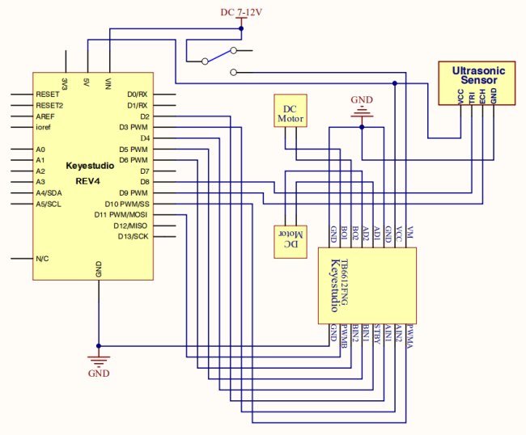
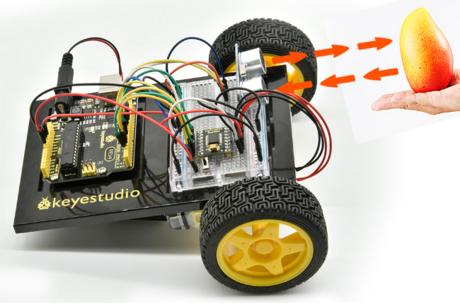

### Project 26 Object Following Robot

**1.About this circuit**

In this circuit, you’ll control two motors and build your own object following robot! The robot that you will build uses a simple ultrasonic sensor to follow an object wherever it moves.

**2.What You Need**

| Gear Motor x 2                         | TB6612FNG Motor Driver x 1 | Slide switch x 1                       | ultrasonic sensor x 1                  | Jumper wires x 25                      |
| -------------------------------------- | -------------------------- | -------------------------------------- | -------------------------------------- | -------------------------------------- |
|  |         |  |  |  |

**3.Hookup Guide**

Check out the circuit diagram and hookup table below to see how everything is connected.


**4.Circuit Diagram**



**5.Upload Code**

```c
int AIN1=2;
int AIN2=3;
int STBY=4;
int BIN1=5;
int BIN2=6;
int PWMA=10;// enable pin 1
int PWMB=11;// enable pin 2
int pinTrip = 8;  //define ultrasonic ting pin to D12
int pinEcho = 9;   //define ultrasonic echo pin to D13
int Fspeed;
int Lspeed;
int Rspeed;

void setup()
{
  Serial.begin(9600);
  int i;
  for (i=2;i<=6;i++) // Ardunio motor driver module
  pinMode(i,OUTPUT); // set digital pins 2,3,4,5,6 as output
  pinMode(10,OUTPUT);// set digital pins 10, 11 as output
  pinMode(11,OUTPUT);
  pinMode(pinTrip,OUTPUT);
  pinMode(pinEcho,INPUT); 
}

void ask_pin_F()   // measure the front distance 
{
   digitalWrite(pinTrip, LOW);   //  make ultrasonic emit LOW voltage 2μs
   delayMicroseconds(2);
   digitalWrite(pinTrip, HIGH);  // make ultrasonic emit HIGH voltage 10μs，here at least 10μs
   delayMicroseconds(10);
   digitalWrite(pinTrip, LOW);    // make ultrasonic emit LOW voltage
   float Fdistance = pulseIn(pinEcho, HIGH);  // read the time difference
   Fdistance= Fdistance/5.8/10;       // turn time into distance （unit：cm） 
   Fspeed = Fdistance;              // read distance into Fspeedd(front speed)
   Serial.print("Fspeed = ");
   Serial.print(Fspeed );
   Serial.println("  cm");   
} 

void loop() 
{      
     ask_pin_F();            // read the front distance
     if(Fspeed >0&&Fspeed <= 15)         //if front distance is less than 10cm   
     {
      	back(); 
     }
     if(Fspeed >15&&Fspeed <= 20)         //if front distance is less than 10cm
     {
       stop(); 
     }
     if(Fspeed >20&&Fspeed <= 40)         //if front distance is less than 10cm
     {
       front(); 
     }
     if(Fspeed >40)         //if front distance is less than 10cm   
     {
       stop();
     }
}    
void front()
{
    digitalWrite(STBY,HIGH);
    digitalWrite(AIN1,HIGH);
    digitalWrite(AIN2,LOW);
    analogWrite(PWMA,200);
    digitalWrite(BIN1,HIGH); 
    digitalWrite(BIN2,LOW);
    analogWrite(PWMB,200);
}

void back()
{
    digitalWrite(STBY,HIGH);
    digitalWrite(AIN1,LOW);
    digitalWrite(AIN2,HIGH);
    analogWrite(PWMA,200); 
    digitalWrite(BIN1,LOW);
    digitalWrite(BIN2,HIGH);
    analogWrite(PWMB,200); 
}

void stop()
{
  digitalWrite(STBY,LOW);
}

void left() 
{
    digitalWrite(STBY,HIGH);
    digitalWrite(AIN1,HIGH);
    digitalWrite(AIN2,LOW);
    analogWrite(PWMA,200); 
    digitalWrite(BIN1,LOW);
    digitalWrite(BIN2,HIGH);
    analogWrite(PWMB,200); 
}

void right() 
{
    digitalWrite(STBY,HIGH);
    digitalWrite(AIN1,LOW);
    digitalWrite(AIN2,HIGH);
    analogWrite(PWMA,200); 
    digitalWrite(BIN1,HIGH); 
    digitalWrite(BIN2,LOW);
    analogWrite(PWMB,200); 
}
```

**6.Result**

When the switch is turned off, the robot will sit still.When the switch is turned on, the robot will drive forward until it senses an object.When it senses an object in its path, it will follow an object ahead to move.



