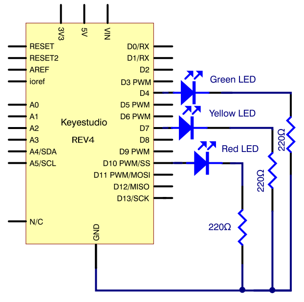
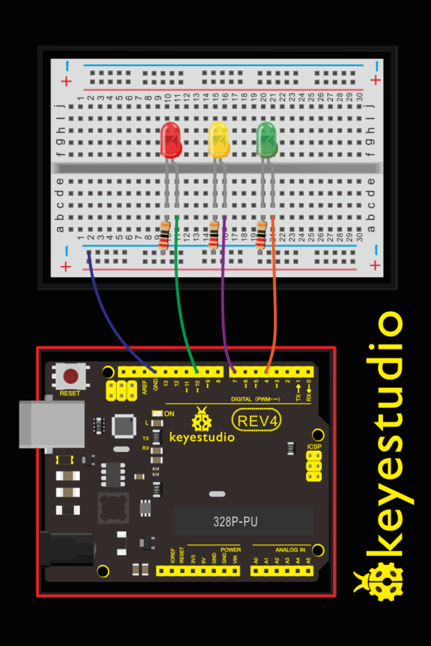
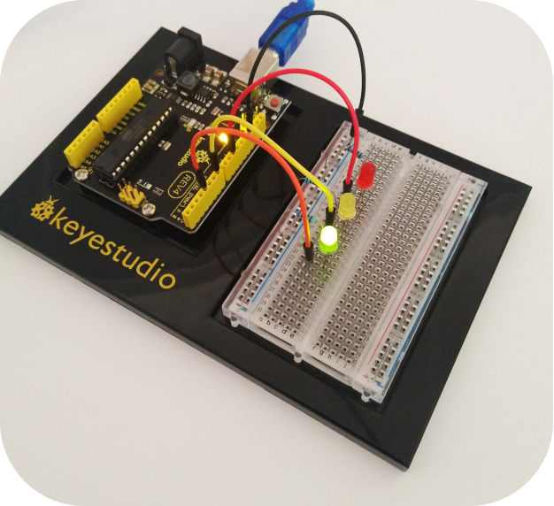

### Project 3 make traffic light

**1.What You Need**

| REV4 Baseplate                         | Red LED x 1      | Yellow LED x 1                         | Green LED x 1                          |
| -------------------------------------- | ---------------- | -------------------------------------- | -------------------------------------- |
|  |  |  |  |
| 220Ω Resistor x 3                      | Jumper wires x 4 | USB cable x 1                          |                                        |
|                        |  |                        |                                        |

**2.Hookup Guide**





**3.Source Code**

```c
int redled =10; // initialize digital pin 8.
int yellowled =7; // initialize digital pin 7.
int greenled =4; // initialize digital pin 4.

void setup()
{
    pinMode(redled, OUTPUT);// set the pin with red LED as “output”
    pinMode(yellowled, OUTPUT); // set the pin with yellow LED as “output”
    pinMode(greenled, OUTPUT); // set the pin with green LED as “output”
}

void loop()
{
    digitalWrite(greenled, HIGH);//// turn on green LED
    delay(5000);// wait 5 seconds
    digitalWrite(greenled, LOW); // turn off green LED
    for(int i=0;i<3;i++)// blinks for 3 times
    {
        delay(500);// wait 0.5 second
        digitalWrite(yellowled, HIGH);// turn on yellow LED
        delay(500);// wait 0.5 second
        digitalWrite(yellowled, LOW);// turn off yellow LED
    } 
    delay(500);// wait 0.5 second
    digitalWrite(redled, HIGH);// turn on red LED
    delay(5000);// wait 5 second
    digitalWrite(redled, LOW);// turn off red LED
}
```

**4.Result**

Done uploading the code, you can see your own designed traffic light. This circuit design is very similar with the one in LED chase effect. The green light will turn on for 5 seconds, and then off, followed by the yellow light blinking for 3 times, and then red light turns on for 5 seconds, circularly and repeatedly.

