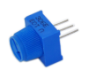
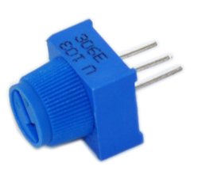
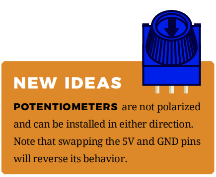
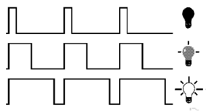
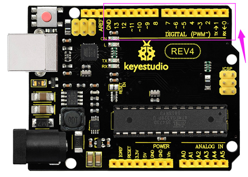
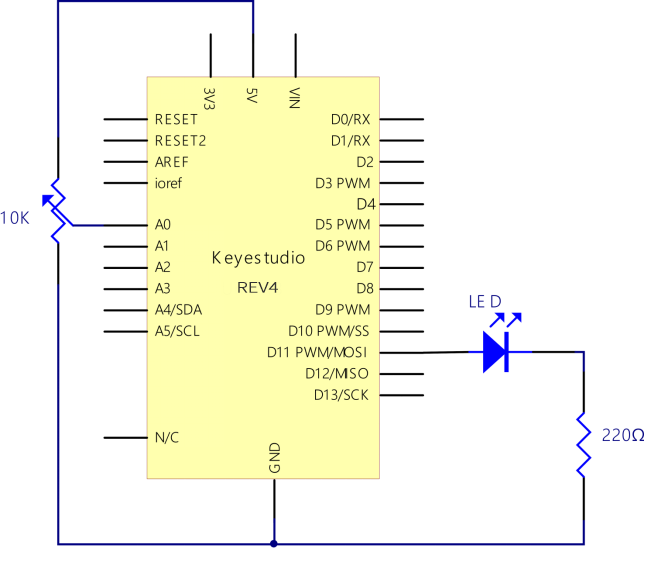
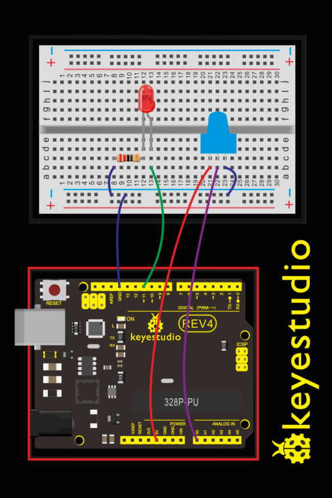
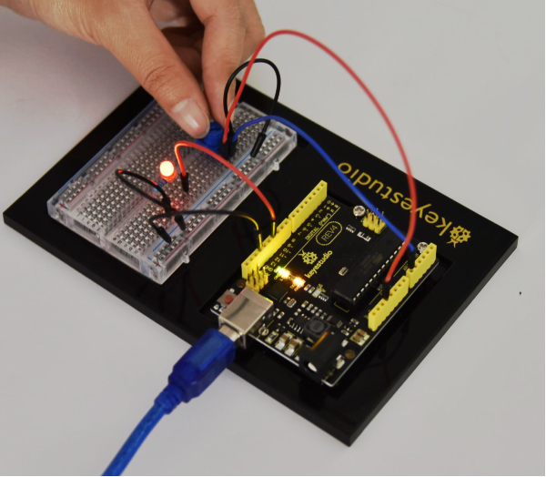
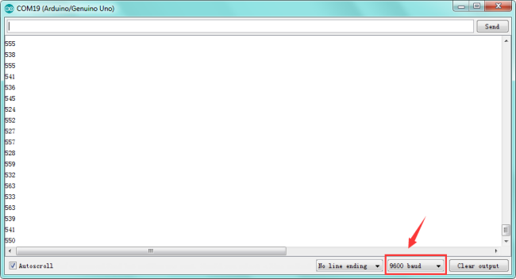

###  Project 4 Potentiometer

**1.About this circuit**

In the previous project, you have learned how to turn on or off an LED. In this circuit, you’ll use a potentiometer as an input device to control the speed at which your LED blinks. Here may involves a new concept PWM to control the brightness of an LED. Check more details below.

**2.What You Need**

| REV4 Baseplate                                         | Potentiometer x 1                      | Red LED x 1      | 220Ω Resistor x 1                   | Jumper wires x 6                | USB cable x 1                 |
| ------------------------------------------------------ | -------------------------------------- | ---------------- | ----------------------------------- | ------------------------------- | ----------------------------- |
| REV4 Baseplate： |  |  | 220Ω Resistor ：    | Jumper wires：  | USB cable ：  |

**3.Component Introduction**

- POTENTIOMETER



Potentiometers (also known as“trimpots”or“knobs”) are one of the basic inputs for electronic devices.

A potentiometer is a 3-pin variable resistor. When powered with 5V, the middle pin outputs a voltage between 0V and 5V, depending on the position of the knob on the potentiometer.

By tracking the position of the knob with your REV4 Board, you can make volume controls, speed controls, angle sensors and a ton of other useful inputs for your projects.



- PWM Control



PWM is short for Pulse Width Modulation.

Pulse Width Modulation, or PWM, is a technique for getting analog results with digital means.Digital control is used to create a square wave of different duty cycle, a signal switched between on and off. This on-off pattern can simulate voltages in between full on (5 Volts) and off (0 Volts) by changing the portion of the time the signal spends on versus the time that the signal spends off. In the graphic, the green lines represent a regular time period.


This duration or period is the inverse of the PWM frequency. In other words, with Arduino's PWM frequency at about 500Hz, the green lines would measure 2 milliseconds each.

A call to analogWrite() is on a scale of 0-255, such that analogWrite(255) requests a 100% duty cycle (always on), and analogWrite(127) is a 50% duty cycle (on half the time) for example.

To be simply, we all know that the voltage output of Arduino Digital port only has two states, LOW and HIGH, corresponding to the voltage output of 0V and 5V.

If merely make use of LOW and HIGH state, it cannot control the brightness of an LED light. However, if convert the voltage output of 0 Volts and 5 Volts into the value within 0-255, this way you can change the value within 0-255 to control the brightness of light.

The Arduino controller has totally 6 PWM outputs, which are Digital 3, 5, 6, 9, 10 and 11. These pins can be used as Digital output or Analog output. If used as Analog output, it needs to call the **analogWrite()** function of ARDUINO, and this analogWrite() function can be controlled in the range of 0-255.



**4.Hookup Guide**

The input of potentiometer is analog, so we connect it to analog port, and LED to PWM pin.
Different PWM signals can regulate the LED brightness.





**5.Upload Code**

```c
int potpin=0;// initialize analog pin 0
int ledpin=11;//initialize digital pin 11（PWM output）
int val=0;// Temporarily store variables' value from the sensor

void setup()
{
    pinMode(ledpin,OUTPUT);// define digital pin 11 as “output”
    Serial.begin(9600);// set baud rate at 9600
    // attention: for analog ports, they are automatically set up as “input”
}

void loop()
{
    val=analogRead(potpin);// read the analog value from the sensor and assign it to val
    Serial.println(val);// display value of val
    analogWrite(ledpin,val/4);// turn on LED and set up brightness（maximum output of PWM is 255）
    delay(10);// wait for 0.01 second
}
```

**6.Code Explanation**

```
int potpin=0;// initialize analog pin 0
```

A variable is a placeholder for values that may change in your code. You must introduce, or“declare,”variables before you use them. Here we’re declaring a variable called potPosition of type int (integer).

```
Serial.begin(9600)
```

Serial commands can be used to send and receive data from your computer. Notice that the baud rate, 9600, is the same as the one we selected in the monitor. This is the speed at which the two devices communicate, and it must match on both sides.

```
val=analogRead(potpin)
```

We use the analogRead() function to read the value on an analog pin.

```
Serial.println(val);
```

This is the line that actually prints the trimpot value to the monitor.

**7.Result**

You should see the LED brighter or dim in accordance with your potentiometer. 



