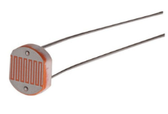
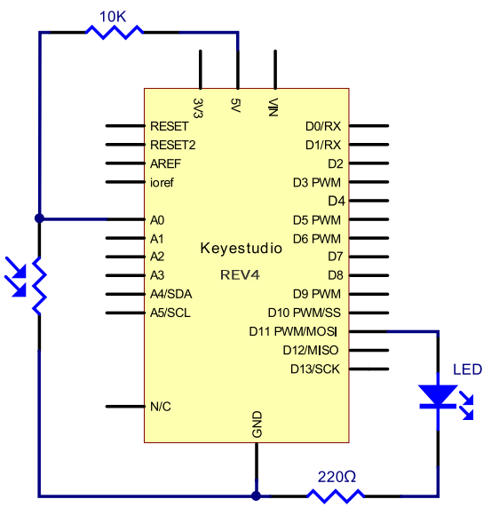
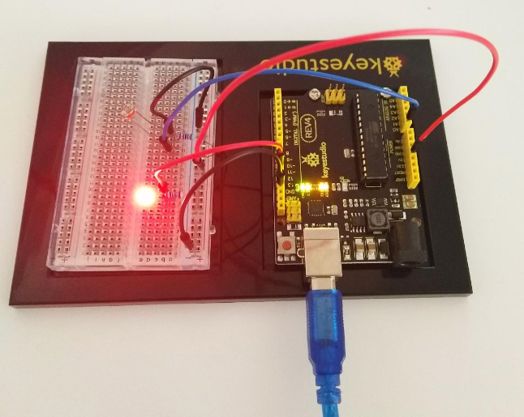
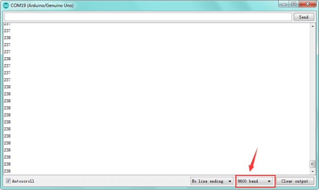

### Project 5 Photo Resistor

**1.About this circuit**

In the previous circuit, you have learned how to use a potentiometer as an input device to control the LED’s brightness.

In this circuit, you’ll be using a photoresistor, which changes resistance based on how much light the sensor receives.

Using this sensor you can make a simple night-light that turns on when the room gets dark and turns off when it is bright.

**2.What You Need**

| REV4 Baseplate                         | Potentiometer x 1                      | Red LED x 1      | 220Ω Resistor x 1 |
| -------------------------------------- | -------------------------------------- | ---------------- | ----------------- |
|  |  |  |   |
| 10KΩ Resistor x 1                      | Jumper wires x 5                       | USB cable x 1    |                   |
|                        |                        |  |                   |

**3.Component Introduction**



Photo resistor (Photovaristor) is a resistor whose resistance varies according to different incident light strength. 

It's made based on the photoelectric effect of semiconductor. If the incident light is intense, its resistance reduces; if the incident light is weak, the resistance increases. 

Photo resistor is widely applied to various light control circuit, such as light control and adjustment, optical switches, etc.


Photovaristor is an element that changes its resistance as light strength changes. So we will need to read the analog values.

We can refer to the PWM experiment, replacing the potentiometer with photovaristor. When there is change in light strength, there will be corresponding change on the LED.

**4.Hookup Guide**




**5.Upload Code**

```c
int potpin=0;// initialize analog pin 0, connected with photovaristor
int ledpin=11;// initialize digital pin 11, output regulating the brightness of LED
int val=0;// initialize variable val

void setup()
{
    pinMode(ledpin,OUTPUT);// set digital pin 11 as“output”
    Serial.begin(9600);// set baud rate at“9600”
}

void loop()
{
    val= map(analogRead(potpin),0,1023,0,255);
    Serial.println(val);// display the value of val
    analogWrite(ledpin,val);// turn on the LED and set up brightness（maximum output value 255）
    delay(10);// wait for 0.01 
}
```

**5.Result**

You can change the light intensity around the photovaristor and see corresponding brightness change of the LED. See the light intensity on the serial monitor.



