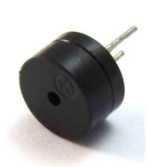
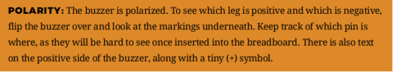
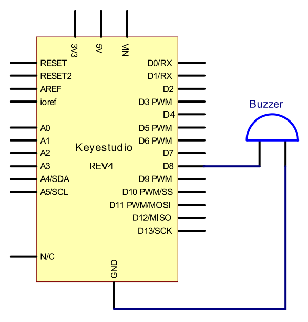
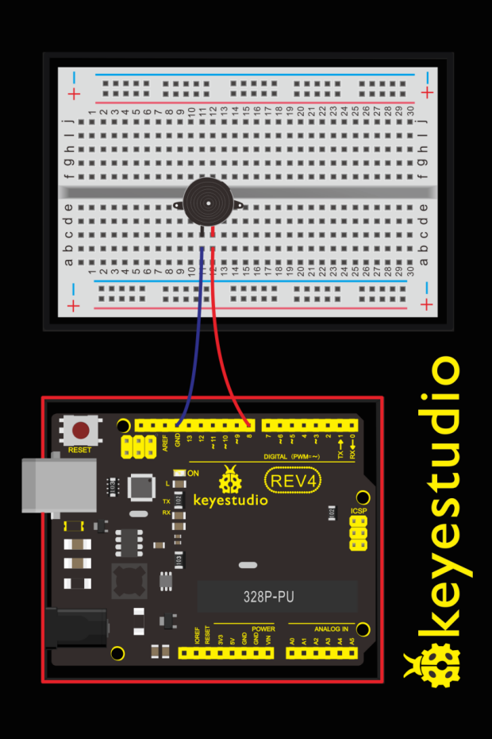
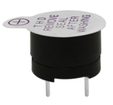
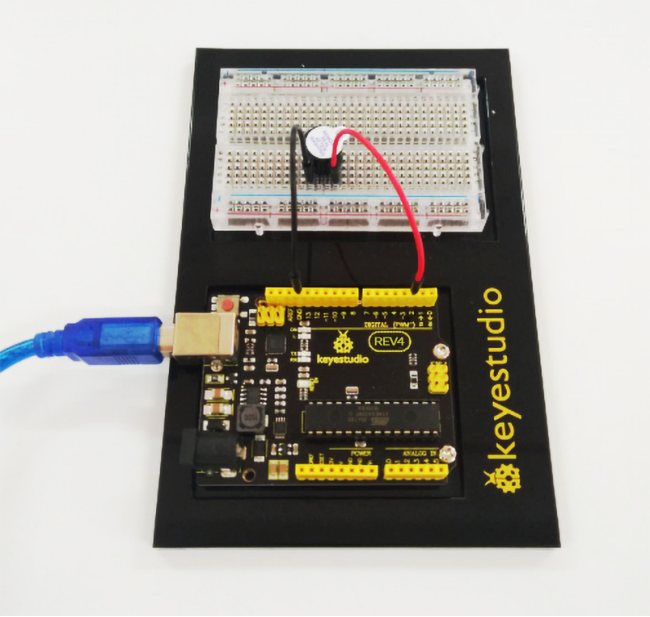

### Project 6 Buzzer

**1.About this circuit**

In this project, you will learn how to make tones with a buzzer.

**2.What You Need**

| REV4 Baseplate                         | Passive Buzzer x 1                     | Jumper wires x 2                | USB cable x 1                 |
| -------------------------------------- | -------------------------------------- | ------------------------------- | ----------------------------- |
|  |  | Jumper wires：  | USB cable ：  |

**3.Component Introduction:**

Buzzers can be categorized as active and passive ones. The difference between the two is that an active buzzer has a built-in oscillating source, so it will generate a sound when electrified.

A passive buzzer does not have such a source, so DC signal cannot drive it beep. Different frequencies produce different sounds. By the buzzer, you can even play a song.





**4.Hookup Guide**

Wiring the buzzer connected to the REV4 board, the red (positive) to the pin8, black wire (negative) to the GND.





**5.Upload Code**

```c
int buzzer=8;// select digital IO pin for the buzzer

void setup() 
{ 
	pinMode(buzzer,OUTPUT);// set digital IO pin pattern, OUTPUT to be output 
} 

void loop() 
{ 
    unsigned char i,j;//define variable
    while(1) 
    { 
        for(i=0;i<80;i++)// output a frequency sound
        { 
            digitalWrite(buzzer,HIGH);// sound
            delay(1);//delay1ms 
            digitalWrite(buzzer,LOW);//not sound
            delay(1);//ms delay 
        } 
        for(i=0;i<100;i++)// output a frequency sound
        { 
            digitalWrite(buzzer,HIGH);// sound
            digitalWrite(buzzer,LOW);//not sound
            delay(2);//2ms delay	 
        }
    } 
} 
```

**6.Test Result**

Done uploading the code to the board, the passive buzzer will make a tone.

**7.active buzzer**



The use method is almost the same. Think about it and try to make an audible beep from active buzzer.

Test code is showed below:

```c
int buzzer=2;// initialize digital IO pin that controls the buzzer

void setup() 
{ 
    pinMode(buzzer,OUTPUT);// set pin mode as “output”
} 

void loop() 
{
	digitalWrite(buzzer, HIGH); // produce sound
}
```

From the test code, we can know the buzzer’s positive lead (long lead) is connected to Digital pin 2 of REV4. The short lead is connected to ground.

