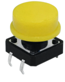
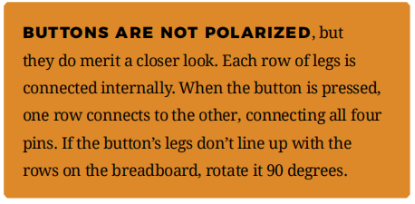
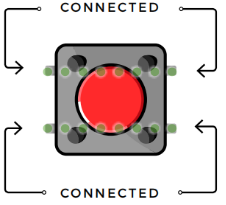
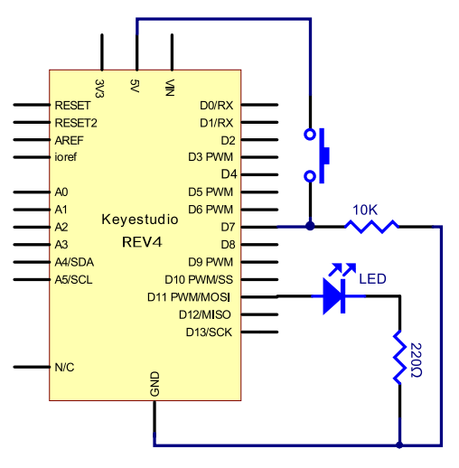
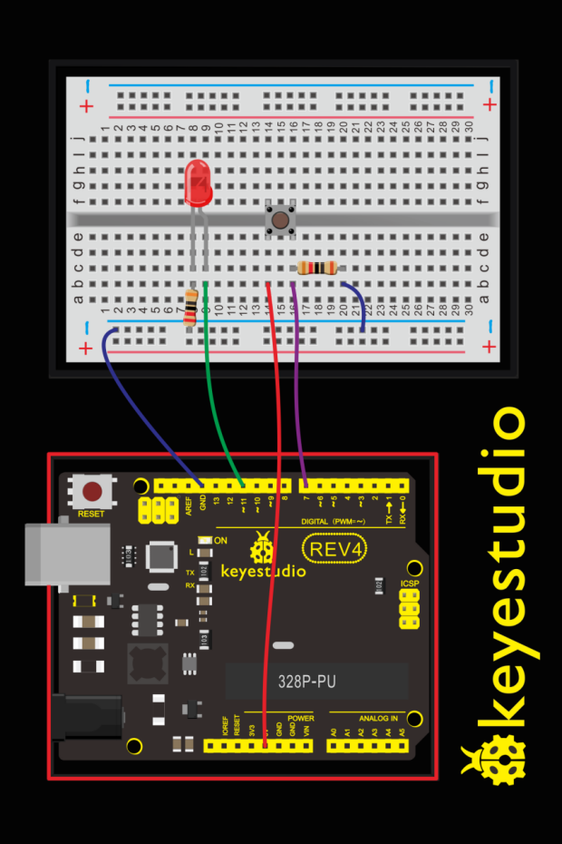
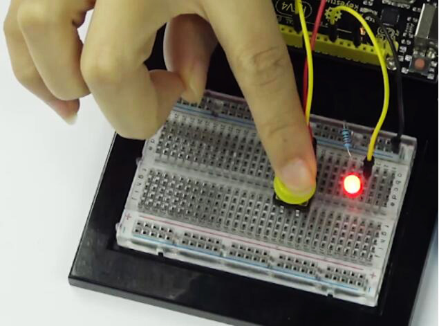
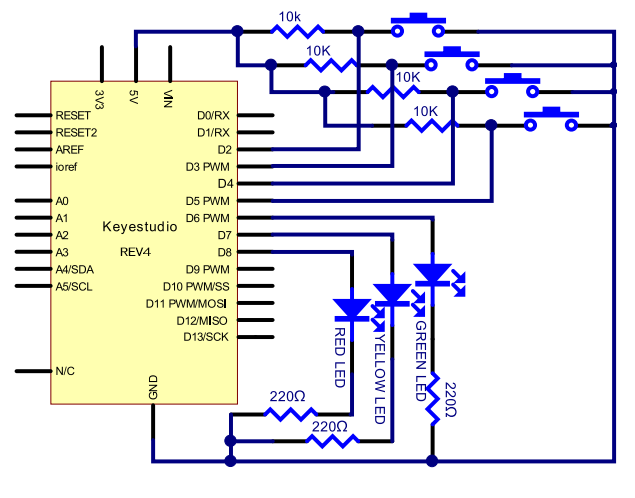
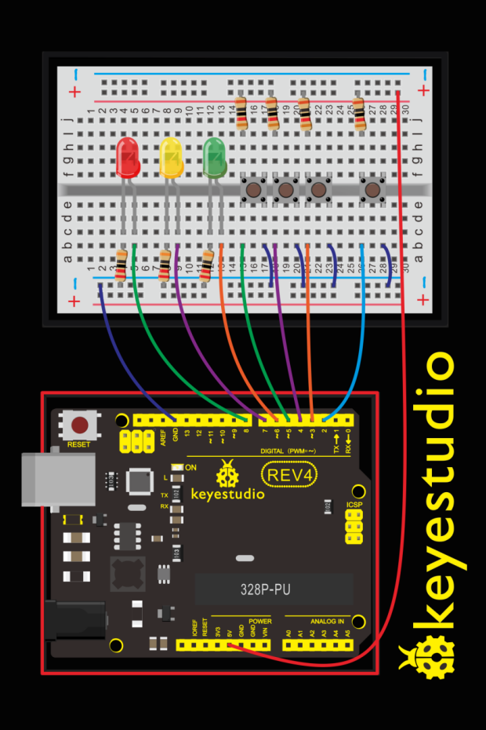
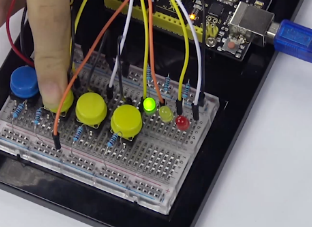

### Project 7 Button

**1.About this circuit**

Buttons are all around us, from the keys on your keyboard to the buttons on your remote control.
In this circuit, you’ll learn how to use the button to control the LED on and off using digital input.

**2.What You Need**

| REV4 Baseplate                         | Button x 1                             | 220Ω Resistor x 1 | 10KΩ Resistor x 1 |
| -------------------------------------- | -------------------------------------- | ----------------- | ----------------- |
|  |  |   |   |
| Jumper wires x 5                       | Red LED x 1                            | USB cable x 1     |                   |
|                        |                        |   |                   |

**3.Component Introduction**



Also known as momentary switches, buttons only remain in their ON state as long as they’re being actuated, or pressed.

Most often momentary switches are best used for intermittent user-input cases: reset button and keypad buttons.

These switches have a nice, tactile, “clicky” feedback when you press them. Note that the different colors are just aesthetic. All of the buttons included behave the same, no matter their color.





**4.Hookup Guide**





**5.Upload Code**

```c
int ledpin=11;// initialize pin 11
int inpin=7;// initialize pin 7
int val;// define val

void setup()
{
    pinMode(ledpin,OUTPUT);// set LED pin as “output”
    pinMode(inpin,INPUT);// set button pin as “input”
}

void loop()
{
    val=digitalRead(inpin);// read the level value of pin 7 and assign if to val
    if(val==LOW)// check if the button is pressed, if yes, turn on the LED
    { 
    	digitalWrite(ledpin,LOW);
    }
    else
    { 
    	digitalWrite(ledpin,HIGH);
    }
}
```

**6.Code Explanation**

```
digitalRead(pin);
```

Check to see if an input pin is reading HIGH (5V) or LOW (0V). Returns TRUE (1) or FALSE (0) depending on the reading.

**7.Result**

When the button is pressed, LED is on; otherwise, LED remains off. After the above process, the button controlled LED experiment is completed. The simple principle of this experiment is widely used in a variety of circuit and electric appliances.



**8.How to make responder effect**

Create your own exciting game. You can try to use three buttons to control three LEDs, one button used as reset button to make a responder. See what will happen?





Upload Code

```c
int redled=8;     // set red LED as “output”
int yellowled=7;  // set yellow LED as “output”
int greenled=6;   // set green LED as “output”
int redpin=5;     // initialize pin for red button
int yellowpin=4;  // initialize pin for yellow button
int greenpin=3;   // initialize pin for green button
int restpin=2;   // initialize pin for reset button
int red;
int yellow;
int green;

void setup()
{
    pinMode(redled,OUTPUT);
    pinMode(yellowled,OUTPUT);
    pinMode(greenled,OUTPUT);
    pinMode(redpin,INPUT);
    pinMode(yellowpin,INPUT);
    pinMode(greenpin,INPUT);
}

void loop()  // repeatedly read pins for buttons
{
    red=digitalRead(redpin);
    yellow=digitalRead(yellowpin);
    green=digitalRead(greenpin);
    if(red==LOW)
    	RED_YES();    
    if(yellow==LOW)
    	YELLOW_YES();
    if(green==LOW)
    	GREEN_YES();
}

void RED_YES()// execute the code until red light is on; end cycle when reset button is pressed
{
  while(digitalRead(restpin)==1)
  {
   digitalWrite(redled,HIGH);
   digitalWrite(greenled,LOW);
   digitalWrite(yellowled,LOW);
  }
  clear_led();
}

void YELLOW_YES()// execute the code until yellow light is on; end cycle when reset button is pressed
{
  while(digitalRead(restpin)==1)
  {
  digitalWrite(redled,LOW);
  digitalWrite(greenled,LOW);
  digitalWrite(yellowled,HIGH);
  }
  clear_led();
}

void GREEN_YES()// execute the code until green light is on; end cycle when reset button is pressed
{
  while(digitalRead(restpin)==1)
  {
  digitalWrite(redled,LOW);
  digitalWrite(greenled,HIGH);
  digitalWrite(yellowled,LOW);
  }
  clear_led();
}

void clear_led()// all LED off
{
  digitalWrite(redled,LOW);
  digitalWrite(greenled,LOW);
  digitalWrite(yellowled,LOW);
}
```

Press the button to turn corresponding LED on and off.


