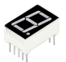
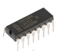
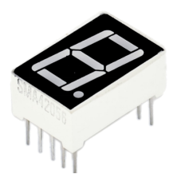
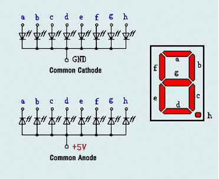
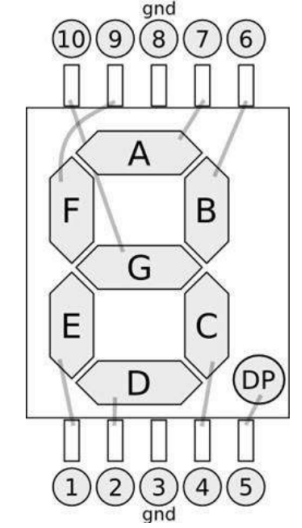
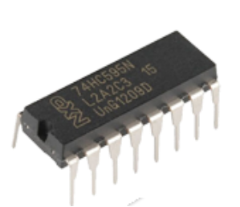
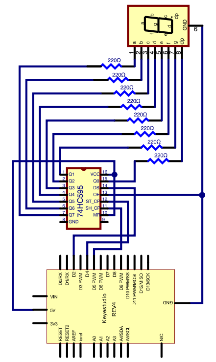
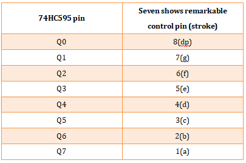
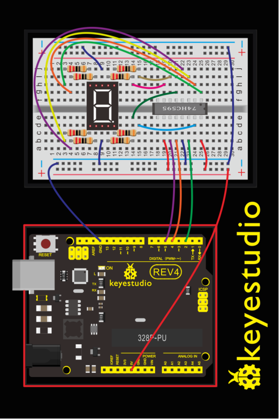
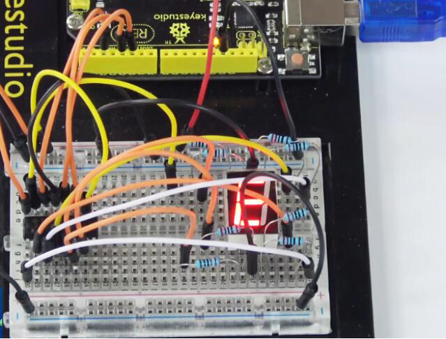

### Project 8 74HC595 And Segment Display

**1.About this circuit**

In this circuit, we will use the 74HC595 shift register to control the segment display. The segment display will show number from 0-9.

**2.What You Need**

| REV4 Baseplate                         | 1-digit 7-seg Display x 1              | 74HC595 IC x 1                         | 220Ω Resistor x 8 | Jumper wires x 19 | USB cable x 1    |
| -------------------------------------- | -------------------------------------- | -------------------------------------- | ----------------- | ----------------- | ---------------- |
|  |  |  |   |   |  |

**3.Component Introduction**

- Seven segment display



LED segment display is a semiconductor light-emitting device. Its basic unit is a light-emitting diode (LED).

For the common anode display, connect the common anode (COM) to +5V. When the cathode level of a certain segment is low, the segment is on; when the cathode level of a certain segment is high, the segment is off.

For the common cathode display, connect the common cathode (COM) to GND. When the anode level of a certain segment is high, the segment is on; when the anode level of a certain segment is low, the segment is off.

Each segment of the display consists of an LED. So when you use it, you also need to use a current-limiting resistor. Otherwise, LED will be burnt out.

When using 1-digit 7-segment display please notice that if it is common anode, the common anode pin connects to the power source; if it is common cathode, the common cathode pin connects to the GND.



In this experiment, we use a common cathode display. Below is the seven-segment pin diagram.



- 74HC595 IC



The shift register operates in a fairly simple way, but can be modified to become very complicated but very useful. We can control the shift of the register with clock pulses.

As we raise the signal going to the clock pin to high, the clock is moved forward one step, and when we pull it low and high again it shifts another.

Each time we shift the clock we switch the input to a different one of the eight registers. We are essentially controlling the output of each of the eight pins one at a time, and as we move one clock signal forward, we switch to the next output pin to control.

The shift register can be a great tool when you are short on output pins, taking 8 outputs from only about 3 actual data inputs.

It can be added to for some really complicated applications, and they can be daisy-chained together for even more output options.

In this project, we only use three I\O ports to control a, b, c, d, e, f, g and dp, therefore control the segment display.


**4.Hookup Guide**

Check out the circuit diagram and hookup table below to see how everything is connected.



The following table shows the seven-segment display 74HC595 pin correspondence table:



- Step one: Connect 74HC595

  First, the wiring is connected to power and ground:

  1. VCC (pin 16) and MR (pin 10) connected to 5V

  2. GND (pin 8) and OE (pin 13) to ground

  Connection DS, ST_CP and SH_CP pin:

  1. DS (pin 14) connected to REV4 board Digital pin 2;
  2. ST_CP (pin 12, latch pin) connected to REV4 Digital pin 4;
  3. SH_CP (pin 11, clock pin) connected to REV4 Digital PWM pin 5.

- Step two: Connect the seven segment display

The seven-segment display pin 9 to REV4 board GND. According to the table above, connect the 74HC595 Q0 ~ Q7 to seven-segment display corresponding pin (A ~ G and DP), and then each foot in a 220 ohm resistor in series.



**5.Upload Code**

```c
int latchPin = 4;
int clockPin = 5;
int dataPin = 2; //define three pins

void setup ()
{
  pinMode(latchPin,OUTPUT);
  pinMode(clockPin,OUTPUT);
  pinMode(dataPin,OUTPUT); //three pins as output
}

void loop()
{
  int a[10]={252,96,218,242,102,182,190,224,254,246};   //define functional array
  for(int x=0; x<10 ;x++ )                        //calculate counting function
  {
      digitalWrite(latchPin,LOW);
      shiftOut(dataPin,clockPin,MSBFIRST,a[x]);     //display array a[x]
      digitalWrite(latchPin,HIGH);
      delay(1000);
  }
}
```

**6.Result**

Hookup well and upload the code to board, you can count the numbers on segment display from 0 to 9.

