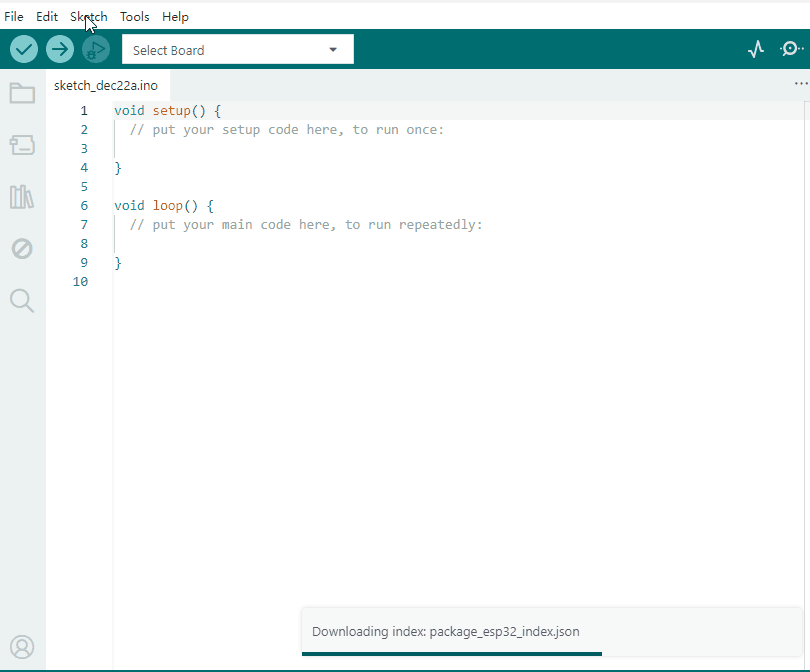
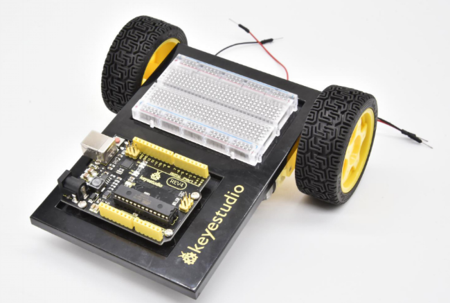
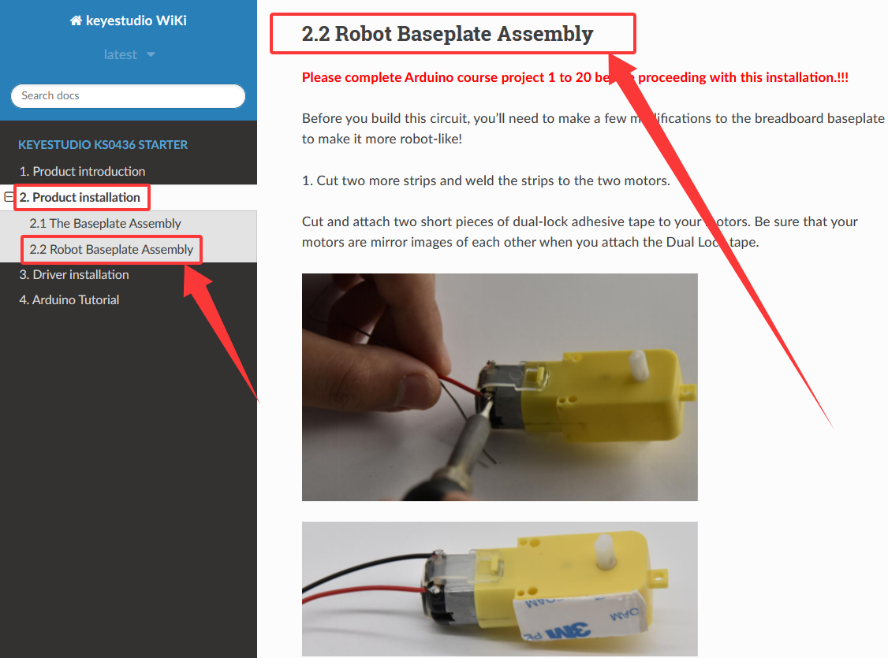

# 4. Arduino Tutorial

## 4.1 Resource download

Arduino information contains library files and project code ,please click to download for follow-up study.

Resource download: [Arduino](./Arduino.7z)

## 4.2 Software Download

Open the browser, copy and paste the link: ``https://www.arduino.cc/en/software`` to the browser's link search box. We will take WINDOWS system as an example to show you how to download and install.

You just need to click JUSTDOWNLOAD,then click the downloaded file to install it.And when the ZIP file is downloaded,you can directly unzip and start it.

## 4.3 Set Arduino IDE 

Connecting the board to the computer，and select the development board and port.

## 4.4 Add Library

Open the Arduino IDE, follow [Sketch] → [Include Library] → [Add .zip Library]. This method can only import one library file at a time. If the product has multiple libraries, please import them one by one following this process!

## 4.5 Project

**GET STARTED WITH CIRCUIT PROJECTS!**

There are 20 circuit projects total. Each project will introduce new concepts and components, which will be described in more detail as you progress through the circuits.

As you work your way through each circuit, you will learn to use new and more complicated parts to accomplish increasingly complex tasks.

The project will set the foundation for the rest and will aid in helping you understand the fundamentals of circuit building and electricity!

**GET STARTED WITH ROBOT PROJECTS!**

In this project, you will learn all about DC motors and motor drivers by building your own robot! You’ll first learn motor control basics. By adding an IR receiver, remote control the robot to move freely. By adding an IR receiver or distance sensor, the robot can learn how to avoid obstacles.

**Please follow the installation guide for the car as shown in the picture below. After completing the installation, continue studying from Project 21 to Project 25.**

